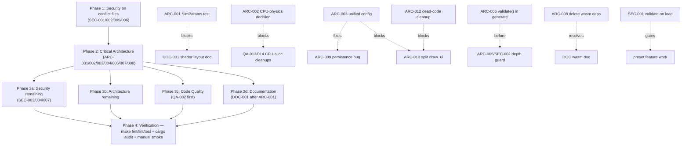

# Project Audit Report

> **Project**: par-particle-life
> **Date**: 2026-07-20
> **Stack**: Rust (edition 2024, MSRV 1.93), wgpu 29, egui 0.34, glam, ~17,400 LOC
> **Audited by**: Claude Code Audit System (4 parallel expert agents + orchestrator verification)

---

## Executive Summary

`par-particle-life` is a well-engineered GPU particle-life simulation whose **runtime GPU pipeline is architecturally sound** — double-buffering, prefix-sum parity, SoA layouts, and the winit event-loop decomposition are all correct and idiomatic. The serious problems live *around* that core: **systemic state duplication** (`AppConfig` ↔ `SimulationConfig` ↔ `App`, synced by 109+ hand-maintained mirrors) that has already drifted into a **verified persistence bug** (temperature & velocity-coupling silently reset on every normal quit); a **CPU physics path presented as the public API that is dead in production and diverges from the live GPU path by a factor of `mass²`**; a **user-facing DSL evaluator that stack-overflows on hostile input and silently propagates NaN to the GPU**; and a **release pipeline that can announce "published to crates.io" while crates.io never received the new version**. None of the headline bugs are caught by the existing tests.

The highest-leverage work is concentrated: fix the three verified bugs, delete ~1,000 lines of dead code (`GameOfLife`, CPU `PhysicsEngine`, `src/ui/mod.rs`, `utils/`, dead input structs, a broken spatial-encoder function), collapse the triplicated state into one source of truth, harden the DSL evaluator, and repair the release/CI tooling so verification commands actually verify. Estimated effort to clear all Criticals + Highs: **~8–12 focused days** for a single maintainer.

**One genuine strength worth leading with**: the test discipline on the deterministic cores (DSL evaluator, generators, buffer-layout invariants, a real headless wgpu test) is better than typical for a hobby project — the bugs above slipped through only because the parity tests use `type_masses=[1.0]` and the close-handler has no test at all.

### Issue Count by Severity

| Severity | Architecture | Security | Code Quality | Documentation | Total |
|----------|:-----------:|:--------:|:------------:|:-------------:|:-----:|
| 🔴 Critical | 8 | 0 | 4 | 4 | **16** |
| 🟠 High     | 15 | 2 | 7 | 7 | **31** |
| 🟡 Medium   | 20 | 3 | 7 | 6 | **36** |
| 🔵 Low      | 15 | 4 | 10 | 5 | **34** |
| **Total**   | **58** | **9** | **28** | **22** | **117** |

> Architecture counts reflect the fully-documented "highlighted" issues; the agent also catalogued additional one-line medium/low mentions (raw totals 8/27/36/31). Cross-agent duplicates (same bug found twice) are flagged below and counted once conceptually but listed in each domain for traceability.

---

## 🔴 Critical Issues (Resolve Immediately)

### [ARC-002] CPU physics diverges from GPU physics by `mass²`, and the CPU path is dead in production
- **Area**: Architecture (also found independently by Code Quality as QA-001 — **verified by orchestrator**)
- **Location**: `src/simulation/physics.rs:247` (spatial) vs the brute-force path's terminal expression; `src/app/handler/update.rs:74`
- **Description**: The brute-force path scales `force / force_factor / type_masses[p_type]` (= `force / (F·m)`); the spatial-hash path ends with `*force /= config.force_factor / type_masses[p_type]` (= `force · m / F`). They differ by a factor of `mass²`. The spatial path is hard-coded on (`use_spatial_hash = true` enforced every frame in `update.rs`/`ui.rs`), so the **live** formula multiplies by mass — inverting the documented meaning of the per-type-mass slider ("higher = slower response to forces"). `App::step()` (the CPU entry) has **zero production callers** (bench-only); the GPU compute path is what actually runs. The existing parity test uses `type_masses = [1.0]`, so the divergence is invisible.
- **Impact**: The Physics-panel mass slider does the opposite of its tooltip on the running sim. Anyone reading `physics.rs` as the source of truth (including a future "CPU fallback") gets wrong mass scaling, no obstacle collision, and an ignored `wall_repel_strength`.
- **Remedy**: Decide keep-vs-delete first (recommend **delete the CPU path** — `PhysicsEngine::step`, `compute_forces_cpu`, `compute_forces_spatial`, `advance_particles`, CPU `apply_boundary`, `App::step`, the bench — the project is GPU-only). If kept as a reference, fix all three divergences and add `tests/physics_cpu_gpu_parity.rs`. At minimum, correct the `physics.rs:247` expression now.

### [ARC-001] `SimParams` Rust↔WGSL layout duplicated across 7 shaders with zero build-time verification
- **Area**: Architecture
- **Location**: `src/renderer/gpu/buffers.rs:322-363` (Rust `SimParamsUniform`); `shaders/particle_forces.wgsl:12`, `particle_forces_binned.wgsl:12`, `particle_advance.wgsl:11`, `particle_render.wgsl:11`, `particle_render_infinite.wgsl:12`, `particle_render_mirror.wgsl:12`, `particle_render_glow.wgsl:12`
- **Description**: The 22-line `SimParams` struct is copy-pasted verbatim into seven WGSL files, with a load-bearing `_padding2: u32` rounding the Rust side to 80 bytes (WGSL uniform 16-byte multiple). Layouts match today; nothing enforces it.
- **Impact**: A single field reorder, type change, or missed padding silently corrupts the sim as "bad physics," not a crash. Same class of risk exists for `PosType` (11 copies), `BrushParams`, `Camera`, `ObstacleData`.
- **Remedy**: Add a compile-time test parsing each WGSL `SimParams` declaration and asserting field order/types/total size against `core::mem::offset_of!`/`size_of`. Long-term, extract shared structs into `shaders/common/*.wgsl` concatenated at load time in `load_shader`.

### [ARC-003] State triplicated across `AppConfig` / `SimulationConfig` / `App`, synced by 109+ hand mirrors
- **Area**: Architecture
- **Location**: `src/app/config.rs:10-132`, `src/app/state.rs:19-62`, `src/app/handler/events.rs:120-145`, `presets_ops.rs:147-173`, `buffer_sync.rs:261-319`, `ui.rs` (31 mirror lines)
- **Description**: The same 20+ physics/render/sim fields exist under different names in `AppConfig` (persisted JSON) and `SimulationConfig` (runtime). Every slider writes `sim_config` then mirrors into `config`; close/preset-apply/reset each reconstruct `AppConfig` by hand in 17–30 line blocks.
- **Impact**: Adding a tunable means editing 5–6 places or silently breaking persistence. **Verified real bug** (ARC-009 below): the close handler omits `temperature` and `velocity_coupling`.
- **Remedy**: Collapse to one source of truth — `AppConfig` owns a `SimulationConfig` via `#[serde(flatten)]`, **or** extract `App::snapshot_config() -> AppConfig` + `App::apply_config(&AppConfig)` called three times instead of duplicating the block.

### [ARC-004] `App::run` reaches up into `handler`, welding the "library" to winit/egui
- **Area**: Architecture
- **Location**: `src/app/state.rs:6,179-189`, `src/lib.rs:14-18,29`
- **Description**: `lib.rs` documents the crate as embeddable and re-exports `App`, but `App::run` instantiates `AppHandler` (egui + wgpu + winit + a winit `ApplicationHandler` impl). The domain layer depends on the platform layer.
- **Impact**: The crate cannot be embedded headlessly (CLI preset converter, property-based physics tests, headless render farm) without launching winit. The "library" framing is misleading.
- **Remedy**: Move `App::run` to a binary-only entry point (`main.rs` or `app/runner.rs` gated out of the lib). `App` becomes pure state + simulation methods.

### [ARC-005] DSL parser/evaluator has no recursion-depth guard (stack overflow on hostile input)
- **Area**: Architecture (also found by Security as SEC-002 — same fix)
- **Location**: `src/generators/expression.rs:520-528` (`parse_unary`→`parse_unary`), `:434-449` (`parse_ternary`→`parse_expr`), `:110` (`Expr::eval`); reached from `src/generators/custom.rs:93`
- **Description**: The recursive-descent parser and evaluator have no nesting limit. Inputs like `"((((…))))"` with ~10k levels or deeply right-nested ternaries recurse once per token and overflow the main-thread stack → SIGSEGV (Rust aborts on stack overflow). Custom generators are loaded from JSON in the platform data dir with no sandboxing.
- **Impact**: A hostile or corrupt custom-generator file (or a 500-paren typo) crashes the app on next startup / next dropdown selection.
- **Remedy**: Thread `depth: u32` through `parse_expr`/`parse_unary`/`parse_ternary`/`parse_primary` and `Expr::eval`; return `ExprError::Parse("expression too deeply nested")` past ~256. Reject input strings longer than ~4 KB in `Expr::parse`.

### [ARC-006] DSL evaluator silently produces NaN/Infinity that reaches the GPU
- **Area**: Architecture
- **Location**: `src/generators/expression.rs:189-192` (`Func::Pow`), `src/generators/custom.rs:107-117`, `src/simulation/particle.rs:210-225` (`validate`, zero callers)
- **Description**: `pow(-1.0, 0.5)` → NaN; `pow(2.0, 99999.0)` → Infinity; `1e30 * 1e30` → Infinity. None caught. `CustomGenerator::generate` rounds to 2 decimals and writes straight into `InteractionMatrix::data`; the matrix's own `validate()` would catch NaN/Inf but is only called from tests.
- **Impact**: A user expression like `pow(i - 2, 0.5)` poisons the matrix, propagates into the GPU compute shader, and produces a blank/jammed sim with **no diagnostic** — very hard for the user to attribute to their expression.
- **Remedy**: After the per-cell loop in `custom.rs::generate`, call `matrix.validate()` and map the error to `ExprError::Eval("expression produced {val} at (i,j) — likely pow() of negative base or overflow")`. Optionally gate `Func::Pow` to error on negative base + non-integral exponent.

### [ARC-007] `crates.io` publish failure silently swallowed; success notification fires regardless
- **Area**: Architecture
- **Location**: `.github/workflows/release.yml:198-211`
- **Description**: The publish step is `cargo publish --token … || echo "Version may already exist on crates.io, continuing…"` with `continue-on-error: true`. Any failure (auth, network, validation, manifest) is masked as success; the next step fires a Discord "Published … successfully!" gated only on `if: success()`. The standalone `publish-crates.yml` handles this correctly.
- **Impact**: A release can be cut, GitHub release + Homebrew bump created, and "published" announcement sent **while crates.io was never updated** — discovered only when a user `cargo install`s and gets the previous version.
- **Remedy**: Drop `continue-on-error` and the `|| echo`. Mirror `publish-crates.yml`'s `cargo search` pre-check, then `cargo publish` strictly.

### [ARC-008] wasm32 target dependencies are dead; the manifest advertises a build the source can't support
- **Area**: Architecture (resolves Documentation DOC-M04)
- **Location**: `Cargo.toml:62-65`; `src/app/handler/init.rs:16`
- **Description**: `[target.'cfg(target_arch = "wasm32")'.dependencies]` pulls `wasm-bindgen`/`web-sys`/`console_error_panic_hook`; grep for any `cfg(wasm32)`/`wasm_bindgen`/`web_sys` in `src/` returns **zero**. Worse, the GPU context is init'd via `pollster::block_on` — wgpu on wasm32 needs a JS-driven async runtime (`wasm-bindgen-futures`); `pollster` cannot drive it, so a wasm32 build would fail to compile or panic on first `block_on`.
- **Impact**: Misleading (web builds look supported but aren't) + supply-chain bloat in the resolver.
- **Remedy**: **Delete the wasm32 target-deps** (recommended — also closes DOC-M04), **or** commit to web: add `cfg` branches, swap `pollster` for a target-conditional executor, add a wasm32 CI job and `docs/WASM.md`.

### [QA-001] (Duplicate of ARC-002) — CPU physics `type_masses` inversion — see ARC-002.

### [QA-002] `benches/physics.rs` does not compile; CI's real lint command fails — **verified by orchestrator**
- **Area**: Code Quality
- **Location**: `benches/physics.rs:31-36`; `.github/workflows/ci.yml` lint job
- **Description**: The bench calls `compute_forces_cpu(&particles, &matrix, &radii, &config)` — 4 args — but the signature now requires 5 (`type_masses: &[f32]` was added). `cargo clippy --all-targets --all-features -- -D warnings` (the exact CI lint command) returns 11 errors. `make lint` omits `--all-targets`, so this is **hidden locally and only fires in CI**.
- **Impact**: Manual CI runs (`workflow_dispatch`-only) go red; `cargo bench` is broken; `make checkall` is misleading post-bench.
- **Remedy**: Pass `black_box(&type_masses)` as arg 5, add `use rand::RngExt;`, and add `--all-targets --all-features` to `make lint` so it's caught locally next time.

### [QA-003] Per-frame GPU pipeline stall while recording video
- **Area**: Code Quality (perf)
- **Location**: `src/app/handler/render.rs:283-289,332-338`; `src/renderer/gpu/context.rs:282-355` (`capture_frame`)
- **Description**: When `is_recording`, every frame calls `gpu.context.capture_frame`, which submits a texture→buffer copy, calls `device.poll(PollType::wait_indefinitely)`, and synchronously maps the staging buffer — a full CPU-side wait for the entire GPU queue on every recorded frame. The ffmpeg thread only off-loads encoding; the readback is on the main thread.
- **Impact**: Recording tanks FPS (one stall/frame + copy cost). Preview stutters while recording.
- **Remedy**: Decouple capture from readback — ring of staging buffers, issue the copy without polling, map the oldest buffer N frames later. (Share a `GpuReadbackRing` helper with ARC-023/QA-004.)

### [QA-004] Periodic 10-second GPU stall from metrics readback
- **Area**: Code Quality (perf)
- **Location**: `src/app/handler/update.rs:101-160`; `src/renderer/gpu/buffers.rs:1139-1148` (`read_bin_counts`)
- **Description**: Every 10 s the metrics block copies the entire bin-counts buffer to a fresh staging buffer and calls `device.poll(wait_indefinitely)` — a full pipeline bubble once per 10 s plus a new allocation each time. The readback only feeds a log line and a `spatial_hash_cell_size` heuristic.
- **Impact**: Visible once-every-10-seconds hitch even on a 144 Hz display.
- **Remedy**: Gate behind `PAR_DEBUG_METRICS=1` or a debug flag, reuse one persistent staging buffer, or move the density heuristic to a GPU reduce pass writing one number to a tiny readback buffer.

### [DOC-001] WGSL `SimParams` byte-layout contract is wrong (cross-file invariant)
- **Area**: Documentation
- **Location**: `docs/SHADERS.md:384-406`
- **Description**: SHADERS.md presents `SimParams` as 14 fields ending in `_padding: [u32; 6]` (offsets 0–80). The actual struct (`src/renderer/gpu/buffers.rs:317-363`) **and** all three WGSL force/advance shaders have **20 fields** with a single trailing `_padding2: u32`. The five undocumented fields: `velocity_coupling`, `temperature`, `frame_counter`, `num_obstacles`, `integration_method`. There is no `[u32; 6]` padding anywhere.
- **Impact**: Anyone porting a shader or debugging GPU layout reads the doc as authoritative and corrupts every uniform access from offset 56 onward — exactly the invariant the doc exists to protect.
- **Remedy**: Replace the block with the real 20-field layout (verified against `buffers.rs` + the three WGSL files), drop the fake `[u32; 6]` line, add a note that this struct is duplicated across `buffers.rs` + three WGSL files and any field reorder is breaking. (Pairs with ARC-001's verification test.)

### [DOC-002] `App::run` API doc shows the wrong parameter (opposite semantics)
- **Area**: Documentation
- **Location**: `docs/API.md:303-309`; `src/lib.rs:13-19`
- **Description**: API.md declares `pub fn run(hide_ui: bool)` with doc "* `hide_ui` — If true, starts with sidebar hidden". Actual signature (`src/app/state.rs:179`) is `pub fn run(reset_config: bool)`, wired to the `--reset-config` CLI flag (`src/main.rs:33`). The parameter does not touch the UI — it wipes persisted config on startup. The crate-level doctest in `src/lib.rs:13-19` repeats the wrong example.
- **Impact**: A library embedder who reads the doc believes they're hiding the UI when they're destroying saved config on every launch.
- **Remedy**: Update `docs/API.md` and `src/lib.rs` to `pub fn run(reset_config: bool)` with correct semantics; mention the `--reset-config` clap flag.

### [DOC-003] CLI flag `--reset-config` is undocumented
- **Area**: Documentation
- **Location**: Missing from `README.md`, `docs/CONFIGURATION.md`, `docs/API.md`; defined at `src/main.rs:18-24`
- **Description**: The only CLI flag the binary exposes appears nowhere in user-facing docs; the in-app `--help` is the only place it's described.
- **Impact**: Users with a corrupted config have no documented escape hatch.
- **Remedy**: Add a "Command-Line Flags" subsection to README.md and a mention in `docs/CONFIGURATION.md`.

### [DOC-004] Homebrew cask pinned to v0.1.0; current release is v0.3.0
- **Area**: Documentation
- **Location**: `homebrew/Casks/par-particle-life.rb:4-6`
- **Description**: The cask hardcodes `version "0.1.0"` with v0.1.0 sha256s; `Cargo.toml` is `0.3.0`. The `livecheck` uses `:github_latest`, so `brew livecheck` flags it as outdated on every install. No `homebrew/README.md`.
- **Impact**: macOS users install a stale 0.1.0 (missing every 0.2.0/0.3.0 feature) or hit a hash mismatch / 404 if v0.1.0 assets were removed.
- **Remedy**: Bump to `version "0.3.0"`, regenerate arm/intel sha256, add `homebrew/README.md`. Verify the publish-cask workflow automates this.

---

## 🟠 High Priority Issues

### Architecture
- **[ARC-009]** `CloseRequested` handler omits `phys_temperature` and `phys_velocity_coupling` — **verified persistence bug** (`src/app/handler/events.rs:120-145` saves force_factor/friction/glow/etc. but not those two). Fixed as a side effect of ARC-003's `snapshot_config()`.
- **[ARC-010]** `draw_ui` is a ~940-line monolith rendering 9 sections inline (`src/app/handler/ui.rs:16-956`). Extract `draw_simulation_section`/`draw_physics_section`/`draw_generators_section`/`draw_obstacles_section`/`paint_obstacle_overlays`. Coordinate with ARC-012 (dead-code cleanup) first per the R1 "Step 0" rule.
- **[ARC-011]** `AppHandler` is a 50+-field god object mixing 9 concerns; the 9 panel-open booleans are duplicated across `AppConfig` + `AppHandler` and re-synced line-by-line on close/reset (`src/app/handler/mod.rs:34-138`, `config.rs:22-38`). Factor into `FpsTracker`/`UiPanelState`/`CaptureState`/`ObstacleEditState`. (Pairs with QA-009.)
- **[ARC-012]** Dead/broken code under `#[allow(dead_code)]`: 3 dead input structs (`input.rs:134-158`), the documented-broken `run_gpu_compute_spatial_on_encoder` (`gpu_compute.rs:396-584`), a function-local `DEBUG_ONCE: AtomicBool` (`gpu_compute.rs:148`), a stale allow on `RuleSelection` (which IS read). Delete.
- **[ARC-013]** Inconsistent error types (`String` vs `anyhow::Result` vs `.expect`) and init-time panics (`init.rs:17`, `events.rs:62`, `gpu_state.rs:179-211`). Adopt one `AppError` enum via `thiserror`, propagate init errors through `resumed`.
- **[ARC-014]** Every field of the re-exported `App` is `pub` (`state.rs:19-62`) — no invariant enforceable. Make `pub(crate)`, expose intentional operations.
- **[ARC-015]** Nine sync methods with no dirty tracking; `update_params` re-uploads uniforms unconditionally per frame (`buffer_sync.rs`, `update.rs:64-70`). Use one `PendingGpuWrites` bitset + `flush_pending_gpu_writes()` at top of `render()`.
- **[ARC-016]** `SimulationConfig::validate()` and matrix validators have **zero callers** and cover only 6 of ~25 fields (`simulation/mod.rs:184-204`, `particle.rs:210-225,296-321`). Wire them in at `App::new`, every preset load, and `SimulationBuffers::new` (debug-assert). (Pairs with SEC-001's preset gate and ARC-006.)
- **[ARC-017]** `GameOfLife` (461 LOC) dead, exported but never used (`simulation/game_of_life.rs`, `mod.rs:12`). Delete or gate behind `feature = "game_of_life"`. (Duplicate QA-007.)
- **[ARC-018]** `Particle` carries 16 bytes of vestigial padding justified by a nonexistent WGSL `vec3<u32>` (`particle.rs:14-33`) — 1 MB wasted at 64k particles, 16 MB at the 1M max. Verify no consumer relies on the 48-byte stride, then drop `_padding2` + add `const _: () = assert!(size_of::<Particle>() == 32);`.
- **[ARC-019]** No seedable RNG; `rand_chacha` declared but imported nowhere (`Cargo.toml:27`); all CPU RNG uses unseeded `rand::rng()`. Custom DSL `random()` matrices regenerate every dropdown open; non-reproducible. Thread a `ChaCha8Rng` from config, or drop `rand_chacha` and admit non-determinism in docs.
- **[ARC-020]** Custom-generator filename sanitizer weaker than the palette sanitizer (`custom.rs:74` replaces only `' '`/`'/'` vs `colors.rs:158`'s alphanumeric allowlist); `dirs::data_dir()` failure silently falls back to CWD (`custom.rs:29-34`). Reuse `safe_palette_file_stem`; replace fallback with `anyhow::bail!`.
- **[ARC-021]** DSL grammar undocumented at the user-facing layer (`docs/GENERATORS.md` omits it). Add a "Custom Generators / Expression DSL" section (precedence, no `^`, div/mod-by-zero→0, unseeded `random()`).
- **[ARC-022]** `RuleGenerator`/`ColorPalette` traits have a single impl each and are never used as `dyn` (`rules.rs:144-154`, `colors.rs:336-346`). Remove.
- **[ARC-023]** `fetch_gpu_timings` calls `device.poll(wait_indefinitely)` every frame, serializing CPU and GPU whenever timestamp queries are supported (the common case) (`gpu_state.rs:294-297`, `gpu_compute.rs:387-389`). Read N frames late (double-buffered resolve) or gate to a profiling flag.
- **[ARC-024]** Render bind groups recreated every frame (`gpu_compute.rs:59-68`); cache two (one per swap state) like `SpatialBindGroupCache`, invalidate only on resize.
- **[ARC-025]** `SpatialParamsUniform` risks silent u32 overflow: `grid_width = (world_size.x / cell_size).ceil() as u32` saturates; `total_bins` wraps (`buffers.rs:33-44,1061-1083`). A UI slider can set `spatial_hash_cell_size` low enough to trigger it (`ui.rs:1217`). Clamp the product; add config validation. (Complements SEC-005, the CPU `SpatialHash` side.)
- **[ARC-026]** No MSRV enforcement in CI; `@stable` alias; README badge "1.88+" vs `Cargo.toml` "1.93" (`.github/workflows/ci.yml:26,67`). Add a CI job pinning the declared MSRV; reconcile README/CLAUDE.md.
- **[ARC-027]** No vulnerability/license/SBOM enforcement: no `cargo-audit`, `.github/dependabot.yml`, CodeQL, `deny.toml`, or `cargo-about` despite AGPL binary distribution. Add them.
- **[ARC-028]** `make checkall` **mutates source** (`checkall: format lint test`, `format: cargo fmt`); CI uses `cargo fmt -- --check`, so local and CI disagree; Makefile also lacks the canonical `fmt`/`typecheck` targets mandated by the global policy (R11) and `.PHONY` for `all`/`bundle`/`run-bundle`. Split `fmt` (check) from `format` (apply), rename `check`→`typecheck`, change `checkall: fmt lint test`.
- **[ARC-029]** No macOS code signing or notarization in any release path (`release.yml:93-149`, `Makefile:71-103`) despite a valid Apple Developer ID. Add `codesign` + `xcrun notarytool submit --wait` + `stapler staple`.
- **[ARC-030]** Release/CI builds don't enforce `--locked`/`--frozen`; `Cargo.lock` (correctly committed) can be regenerated at build time → non-reproducible artifacts. Add `--locked` everywhere + `cargo update --locked --dry-run`.
- **[ARC-031]** GitHub Actions `uses:` pinned to moving refs (`@stable`, `@master`); `Ilshidur/action-discord@master` is a third-party action with no version pin (`.github/workflows/*.yml`). Pin to commit SHAs. (Duplicate SEC-008.)

### Security
- **[SEC-001]** Drag-and-drop preset triggers unbounded allocation / OOM abort — `SimulationConfig::validate()` exists but is never called on the load path (`src/app/handler/presets_ops.rs:111-198`, `simulation/mod.rs:184-204`). A crafted `.json` with `num_particles: 4294967295` OOM-kills the app on drop; mismatched matrix `size`/`data.len()` panics. Gate `apply_preset` on `validate()` + matrix-shape check + a file-size cap on `read_to_string`.
- **[SEC-002]** (Duplicate of ARC-005) Stack exhaustion in DSL recursive-descent parser — same fix as ARC-005.

### Code Quality
- **[QA-005]** `run_gpu_compute_spatial_on_encoder` is ~175 LOC of confirmed-broken dead code, kept under `#[allow(dead_code)]` with a "synchronization issues" note (`gpu_compute.rs:388-583`). Delete.
- **[QA-006]** `src/ui/mod.rs` is a stub (TODO only); `utils/color.rs` has 4 unused functions; `utils/math.rs` (`lerp`/`clamp`/`smoothstep`/`map_range`/`wrap`/`euclidean_mod`/`TAU`) is unused outside its own tests; `colors.rs:402` defines a local `lerp`. Delete the stub + dead utils; remove `pub mod ui;` from `lib.rs`.
- **[QA-007]** (Duplicate of ARC-017) `GameOfLife` 461 LOC dead.
- **[QA-008]** (Duplicate of ARC-012 input-structs portion) `MouseState`/`ModifierState`/`InputState` dead (`input.rs:131-156`).
- **[QA-009]** (Pairs with ARC-011) `AppHandler` god object — 60+ unrelated fields (`handler/mod.rs:42-138`). Group into `RecordingState`/`UiPanelState`/`PresetUiState`.
- **[QA-010]** (Pairs with ARC-003) UI-state mirroring is shotgun surgery — ~25 manual `self.app.config.phys_X = self.app.sim_config.X;` writes; adding a slider and forgetting the mirror silently reverts the setting on next launch. Resolve via ARC-003's single-source-of-truth.
- **[QA-011]** (Pairs with ARC-014) `App::state` is one struct of 22 public mutable fields (`state.rs:25-71`); `type_masses.len()` must equal `num_types` but any handler can resize one without the other. Make private; add `set_num_types(n)` that resizes atomically.

### Documentation
- **[DOC-005]** Generator counts are stale across the doc set: actual `RuleType`=**34**, `PaletteType`=**37**, `PositionPattern`=**31** (verified against source enums); docs/CLAUDE.md/README claim 31/37/28. Also `docs/GENERATORS.md` omits the three 0.3.0 rule generators (**BlockDiagonal, CyclicPursuit, RandomSparse**) and is internally inconsistent (31 in one place, 28 in Mermaid). Update all mentions + Mermaid diagrams in README:231-233 and ARCHITECTURE:59-61. (Pairs with ARC's count-drift finding.)
- **[DOC-006]** `rust-version = "1.93"` in Cargo.toml but README badge + prose ("1.88+") and `CLAUDE.md:55` understate it by 5 minors. Bump to "1.93+". (Pairs with ARC-026.)
- **[DOC-007]** README key-binding table is stale: says F11=record, F12=screenshot; actual is F5=record, F11=fullscreen, F12=screenshot (`events.rs:211-218`). The CHANGELOG 0.3.0 explicitly notes "recording moved to F5" — README wasn't updated.
- **[DOC-008]** `make test # pytest` typo in `CLAUDE.md:24` — this is a Rust project (`cargo test`). README:155 is correct.
- **[DOC-009]** `Particle` struct layout in API.md omits the two padding fields and `#[repr(C, align(16))]` (`docs/API.md:80-92` vs `particle.rs:14-32`, 48 bytes). Anyone sizing buffers against the doc under-allocates 2.4×.
- **[DOC-010]** `RadiusMatrix::new` signature wrong in API.md (`docs/API.md:124-130` shows `new(size)`; actual `new(size, min_radius, max_radius)`); sibling `default_for_size` not mentioned.
- **[DOC-011]** API.md generator module paths wrong — shows `pub mod rules/colors/positions` at crate root; actual is `pub mod generators { ... }` with re-exports (`src/lib.rs:21-27`, `generators/mod.rs:9-13`). Directly contradicts GENERATORS.md's verified examples.

---

## 🟡 Medium Priority Issues (grouped)

### Architecture
- **[ARC-032]** `use_spatial_hash` flag is dead config, force-set `true` every frame (`mod.rs:163`, `update.rs:41`, `ui.rs:1207`); presets carry a meaningless field.
- **[ARC-033]** `App::step` dead in binary, misleads library consumers (`state.rs:192-205`); mark `#[doc(hidden)]` or `#[cfg(test/feature)]`.
- **[ARC-034]** `frame_counter` runtime value mixed into `SimulationConfig`, leaking into every preset JSON (`mod.rs:120-122`); move to `GpuState`/`AppHandler`.
- **[ARC-035]** `#[deprecated]` `egui::Panel::left` retained under two `#[allow(deprecated)]` (`ui.rs:21-22,952-953`); migrate to `SidePanel::left`. (Pairs with QA medium.)
- **[ARC-036]** `compute_forces_cpu` and `compute_forces_spatial` ~95% duplicated (`physics.rs:91-168` vs `:171-249`) — directly caused ARC-002.
- **[ARC-037]** `SpatialHash` invariant (cell ≥ max radius) enforced ad hoc at 6 call sites, not the type boundary (`spatial_hash.rs:35`).
- **[ARC-038]** `positions.rs` DRY violation: the `per_type + remainder` dance duplicated 14× (~100 lines); extract `distribute(n, buckets)`.
- **[ARC-039]** `required_types()` declared but not enforced; `linked_clusters_generator` is an unimplemented alias of `soft_clusters_generator` (`positions.rs:170-179,1046-1049`).
- **[ARC-040]** `Renderer` trait is dead (zero impls; `renderer/mod.rs`); keep `pub mod gpu;`, drop the trait.
- **[ARC-041]** `BrushRenderUniform` matches WGSL only by hand-computed padding coincidence (12-byte gap at offset 64); same failure mode as ARC-001.
- **[ARC-042]** 4 WGSL render shaders duplicate 70%+ of their bodies; extract `shaders/common/`.
- **[ARC-043]** `update_obstacles` silently drops its `_count` param; `num_obstacles` must be set externally at two sites (`buffers.rs:832-837`, `buffer_sync.rs:81,256`). Make `&mut self` + set count internally.
- **[ARC-044]** 4-byte scalar uniforms (`total_bins`, `step_size`) violate the WGSL 16-byte convention; works on Metal/Vulkan, may break DX12/WASM.
- **[ARC-045]** `_brush_bind_group`, singular `step_size_uniform`, `PhysicsEngine::forces()` dead (`gpu_state.rs:255`, `buffers.rs:1001`, `physics.rs:82-84`).
- **[ARC-046]** Release workflow doesn't cross-check CHANGELOG vs version; no branch/tag guard on `workflow_dispatch` (`release.yml:7-8`).
- **[ARC-047]** No `.pre-commit-config.yaml` despite global mandate; release embeds signing secrets.
- **[ARC-048]** No `rustfmt.toml`/`clippy.toml`; no clippy `msrv` lint.
- **[ARC-049]** Redundant direct deps `gif`/`color_quant` (already transitive via `image`); risk of two majors if `image` bumps.
- **[ARC-050]** `publish-crates.yml`/`release.yml` skip `cargo fmt --check`/`clippy -D warnings`; a release can ship lint regressions.

### Security
- **[SEC-003]** Local API credential in `.claude/settings.local.json:3` (`ANTHROPIC_AUTH_TOKEN` → `api.z.ai`), not gitignored. **Rotate the token and add `.claude/settings.local.json` (or `.claude/`) to `.gitignore`.** Not currently tracked, but one `git add .` away from history.
- **[SEC-004]** `cargo audit` hits: `quick-xml 0.39.4` (RUSTSEC-2026-0195/0194, build-time via wayland), `ttf-parser 0.25.1` (RUSTSEC-2026-0192, unmaintained, via winit), `paste 1.0.15` (RUSTSEC-2024-0436, via image). None reachable from app input today; track upstream and re-audit periodically. (Pairs with ARC-027.)
- **[SEC-005]** `SpatialHash::build` integer overflow / allocation blow-up (`spatial_hash.rs:35-50`): `world_size.x=1e30` saturates `usize`/wraps the product; `cell_size.max(1.0)` blocks div-by-zero but not grid bounds. `checked_mul` + hard cap. (Complements ARC-025, GPU side.)

### Code Quality
- **[QA-012]** `ui.rs::draw_ui` ~880-line body (subset of ARC-010).
- **[QA-013]** `compute_forces_cpu` allocates a fresh `Vec<Vec2>` every step (`physics.rs:104`); write into a reused buffer (also pollutes the bench).
- **[QA-014]** `SpatialHash::query_radius` allocates a `Vec<usize>` per particle per step (`spatial_hash.rs:73-118`); switch to `for_each_neighbor` closure or reusable scratch.
- **[QA-015]** `#[allow(clippy::too_many_arguments)]` on 5 constructors (`buffers.rs:510`, `spatial.rs:567`, `compute.rs:310`, `brush.rs:384`, `preset.rs:86`); bundle per-type arrays into a `ParticleView<'a>`.
- **[QA-016]** `colors_as_rgba` clones the whole palette on every call (`state.rs:338-341`) but `Color = [f32;4]`, so it's just `.clone()` under a misleading name; return `&[[f32;4]]` or inline.
- **[QA-017]** Repeated `wgpu::RenderPassDescriptor` boilerplate across 5 render passes (`render.rs`); a `color_pass(encoder, view, label, load)` helper removes ~80 lines.
- **[QA-018]** Three nearly-identical "open folder" `Command::new("open"/"xdg-open"/"explorer")` blocks (`ui.rs:497-506,617-626,1304-1313`); extract `open_in_file_manager(path)`.
- **[QA-019]** `update.rs::update` is a 140-line function doing 6 unrelated things; extract `update_fps`/`process_pending_syncs`/`record_metrics`.

### Documentation
- **[DOC-012]** `docs/CONFIGURATION.md` predates 0.2.0/0.3.0 — missing `temperature`, `type_masses`, `type_sizes`, `velocity_coupling`, `integration_method`, `time_scale`, `obstacles`, `frame_counter` (verified vs `simulation/mod.rs:46-135`).
- **[DOC-013]** 24 MB MP4 committed at repo root (`recording_20251202_174941_000.mp4`); `.gitignore:9` excludes `recording_*.mp4` but the file was tracked before the rule. `git rm --cached` it (safe); `git filter-repo`/BFG for history shrinkage needs explicit confirmation.
- **[DOC-014]** `docs/ARCHITECTURE.md:115-167` module tree omits `matrix_variation.rs`, `obstacle.rs`, and the top-level `src/ui/`; `CLAUDE.md:29-36` omits `src/ui/`, `src/utils/`, `src/video_recorder.rs`.
- **[DOC-015]** README license badge `AGPL--3.0` vs Cargo `AGPL-3.0-or-later`; body text on README:343 is correct. Fix the badge URL.
- **[DOC-016]** CHANGELOG has no `## [Unreleased]` placeholder despite three post-0.3.0 commits (KEEP-A-CHANGELOG convention).
- **[DOC-017]** `docs/SHADERS.md` lists `brush_force.wgsl` then says brush forces are now in `particle_advance.wgsl`; clarify if the standalone shader is dead.

---

## 🔵 Low Priority / Improvements (grouped)

### Architecture
`use_spatial_hash` mirror cleanup (ARC-032 consequence); `RadiusMatrix` missing `debug_assert!`; "aligned to 48 bytes" terminology; magic `0.5` restitution; `MatrixVariationConfig::apply` clones every call; `RuleType::category()` wildcard `_ =>`; `hsv_to_rgb` implicit precondition; shallow generator tests; WGSL compile panic with no recovery; prefix-sum over-counts by 1 for power-of-2 totals; `MAX_PREFIX_PASSES = 32` duplicated; `enable f16;` prepended to shaders that don't need it; binding-0 gap in forces layout; stale "debugging" comment; no code coverage; release profile lacks `strip = true`; MSRV unjustified; sparse integration tests; README wording.

### Security
- **[SEC-006]** Windows-only path traversal in `CustomGenerator::save_to_file` (`custom.rs:74`) — only `' '`/`'/'` replaced, not `..`/`\`. Use `safe_palette_file_stem`. (Pairs with ARC-020.)
- **[SEC-007]** Filesystem paths leaked in user-facing error strings (`presets_ops.rs:122-126`, `ui.rs:145`, ~15 sites). Acceptable for a desktop GUI; optionally `log::error!` full chain and show short UI message.
- **[SEC-008]** (Duplicate of ARC-031) GitHub Actions unpinned.
- **[SEC-009]** `open::that(path)` on `last_capture_path` (`ui.rs:142`) — not attacker-controlled, no shell pass-through; informational only.

### Code Quality
`Particle` padding hand-bookkeeping (use `..Default::default()`); `BoundaryMode::Repel` is `#[default]` but `SimulationConfig::default()` overrides to `Wrap` (`boundary.rs:13` vs `mod.rs:151`); `init.rs` GPU `.expect` unfriendly on headless; `gpu_state.rs` `.expect("X not built")` on cached bind groups; magic numbers (`state.rs:298-303` density model deserves named consts); `generate_rules`/`custom.rs` silent 2-decimal rounding; `ui.rs:745-785` indentation artifact (run `cargo fmt --check`); `num_particles` stored in three drift-prone places.

### Documentation
`ideas.md` not labeled non-authoritative; `docs/superpowers/{plans,specs}/` not in the docs index; `AGENTS.md` is a one-liner (intentional; optionally point to the style guide); API.md missing the `generators::expression`/`generators::custom` public surface (the Custom Generators feature).

---

## Detailed Findings

### Architecture & Design
The runtime GPU pipeline is **sound**: `current_buffer` ping-pong flips at the right point; prefix-sum `offsets_in_a = pass_count.is_multiple_of(2)` tracks accumulation correctly; SoA types (`ParticlePosType`, `ParticleVel`, `ParticleVelHalf`) carry explicit `#[repr(C, align(...))]` with a static byte-offset test. The **winit handler decomposition into 9 focused files** is exemplary. `SpatialBindGroupCache` cleanly encapsulates a genuinely hard caching problem. `AppConfig` schema migration (`#[serde(default = …)]` on every field + a deserialization test) is better discipline than most pre-1.0 projects.

The architectural debt is concentrated in three places: (1) **state triplication** (ARC-003) — 109+ hand mirrors with a verified drift bug; (2) **dead code presented as authoritative** — the CPU `PhysicsEngine` (the documented public API that doesn't run), `GameOfLife`, the `Renderer` trait, `src/ui/mod.rs`, `utils/`, `rand_chacha`, the wasm32 deps, three dead input structs, a documented-broken spatial-encoder function; (3) **tooling that doesn't verify** — `make checkall` mutates source, MSRV isn't enforced, no `cargo audit`/`deny`/dependabot, no `--locked`, GitHub Actions on moving refs, crates.io publish failures swallowed, no macOS signing. The DSL evaluator is under-hardened against its untrusted input (ARC-005/006). Full per-issue detail in the Critical/High/Medium sections above; the agent also catalogued ~30 additional one-line medium/low items (raw totals 8/27/36/31).

### Security Assessment
**Posture: Good.** Zero `unsafe` in `src/`; no network code (fully offline); statically-compiled shaders via `include_str!` with no user input reaching shader source; all `std::process::Command` uses (open/xdg-open/explorer/ffmpeg) go through `.args(...)` with no shell; no `[patch]`/git/path deps, no `build.rs`, no directly-used proc-macros; committed media verified clean of secrets; palette filename sanitization correct; obstacle count GPU-bounded (`MAX_OBSTACLES=16`). The realistic risks are concentrated in the two untrusted-JSON paths — **drag-drop presets skip `validate()`** (SEC-001, OOM) and the **DSL parser has no depth guard** (SEC-002/ARC-005, stack overflow) — plus the **on-disk auth token** (SEC-003) and transitive `cargo audit` hits (SEC-004). No Critical: there is no RCE, no memory-unsafe code, no committed credential in tracked files.

### Code Quality
**Health: Fair.** 73 unit + 14 integration + 1 doctest, all green; test discipline on deterministic cores is genuinely good (DSL evaluator 22 tests, real headless wgpu layout test). The live problems are four Criticals: the **`type_masses` mass-inversion** (QA-001, verified), the **broken benchmark** (QA-002, verified, hidden by `make lint` omitting `--all-targets`), and the **two GPU readback stalls** — per-frame during recording (QA-003) and every 10 s from metrics (QA-004), both `device.poll(wait_indefinitely)`. Dead code is the largest noise source (~1,000 LOC: `GameOfLife`, `ui/mod.rs`, `utils/`, dead input structs, broken spatial encoder). 9 `#[allow(...)]` annotations silence real lints. The two god objects (`AppHandler`, `App`) and the UI-state mirroring shotgun surgery are the maintenance hazards. Files >500 LOC: `ui.rs` (1465), `colors.rs` (1324), `positions.rs` (1254), `buffers.rs` (1157), `rules.rs` (1061).

### Documentation Review
**Health: Fair (structurally strong, factually drifted).** The doc set is substantial and well-styled (consistent Mermaid with the dark-mode palette across all docs, exhaustive generator catalog, step-by-step shader algorithm docs, a documentation style guide, accurate CHANGELOG entries that credit features specifically). But ~a dozen places have drifted from the implementation: the **`SimParams` byte-layout doc is wrong** (DOC-001 — the one invariant SHADERS.md exists to protect), **`App::run` has the wrong parameter** (DOC-002, opposite semantics), **`--reset-config` is undocumented** (DOC-003), the **Homebrew cask is pinned to 0.1.0** (DOC-004), **generator counts are stale** (DOC-005, 31/37/28 vs 34/37/31), the **key-binding table has the F5/F11 swap** (DOC-007), and several API.md signatures don't match source (Particle layout, RadiusMatrix::new, generator module paths). Docstring coverage ~1.4% (237 lines / 17,386 LOC) — public API surface mostly documented, but many public methods in `physics.rs`/`spatial_hash.rs`/`video_recorder.rs` lack `///`.

---

## Remediation Roadmap

### Immediate Actions (before next release)
1. **[ARC-009/ARC-003]** Fix the temperature/velocity_coupling persistence bug (and the 109-mirror hazard) via a single `snapshot_config()`/`apply_config()` pair.
2. **[ARC-002/QA-001]** Decide CPU-physics keep-vs-delete; correct the `mass²` inversion at `physics.rs:247` regardless.
3. **[SEC-003]** Rotate the on-disk `ANTHROPIC_AUTH_TOKEN` and gitignore `.claude/settings.local.json`.
4. **[QA-002]** Fix `benches/physics.rs` (5-arg call + `RngExt`); add `--all-targets` to `make lint`.
5. **[ARC-007]** Stop swallowing `cargo publish` failures in `release.yml`.
6. **[ARC-005/006 + SEC-001/002]** Harden the DSL evaluator (depth guard + NaN/Inf validation) and wire `validate()` into the preset-load path.
7. **[ARC-028]** Make `make checkall`/`fmt`/`typecheck` actually verify (split fmt vs format) so downstream work can trust the gate.

### Short-term (next 1–2 sprints)
1. **[ARC-001]** Add the `SimParams` Rust↔WGSL layout-verification test; pair with DOC-001 doc fix.
2. **[ARC-017/QA-007 + ARC-012/QA-005/008 + ARC-040 + QA-006 + ARC-008]** Delete the dead code cluster (`GameOfLife`, CPU `PhysicsEngine`, `Renderer` trait, `ui/mod.rs`, `utils/`, dead input structs, broken spatial encoder, wasm32 deps).
3. **[ARC-011/QA-009 + ARC-010]** Decompose `AppHandler` + `draw_ui` (after dead-code cleanup).
4. **[QA-003/QA-004/ARC-023]** Build one `GpuReadbackRing` helper to kill all three per-frame/periodic stalls.
5. **[ARC-026/027/030/031]** CI hardening: MSRV job, `cargo audit`+`deny`+dependabot, `--locked`, SHA-pin actions.
6. **[DOC bulk]** Sweep the doc drift (counts, key bindings, rust-version, API signatures, Homebrew cask).

### Long-term (backlog)
1. **[ARC-004]** Extract `App::run` out of the library to enable headless embedding/property tests.
2. **[ARC-042]** Consolidate shared WGSL into `shaders/common/`.
3. **[ARC-029]** macOS signing + notarization in the release workflow.
4. **[ARC-019]** Decide determinism policy; seed or drop `rand_chacha`.
5. **[DOC-013]** History-rewrite the 24 MB MP4 out (needs explicit confirmation).

---

## Positive Highlights

1. **Exemplary winit event-loop decomposition** — 9 focused handler files with mostly non-overlapping responsibilities, the right granularity for this layer.
2. **Correct, idiomatic GPU pipeline** — double-buffering, prefix-sum parity, SoA layouts with explicit `repr(C, align)` and a static byte-offset test.
3. **`SpatialBindGroupCache`** cleanly encapsulates a genuinely hard caching problem (bind groups depending on buffer handles, prefix-sum pass count, and ping-pong state) with a tidy ensure/invalidate lifecycle.
4. **`AppConfig` schema-migration discipline** — `#[serde(default = …)]` on every added field plus a deserialization test; rare in pre-1.0.
5. **Textbook release/dev profiles** — `lto`/`codegen-units=1`/`opt-level=3` release; `opt-level=3` for deps in dev. Cross-OS CI matrix with correct per-OS native deps.
6. **Strong test discipline on deterministic cores** — DSL evaluator, generators, custom-generator AST caching, buffer-layout invariants, and a real headless wgpu device test that uploads + reads back params.
7. **Zero `unsafe`, no network surface, statically-compiled shaders, safe process invocation** — a narrow, defensible threat model executed well.
8. **Consistently styled, genuinely useful Mermaid docs** — rare for a Rust+wgpu project; the shader algorithm walkthroughs are unusually thorough.
9. **Closed, consistently-mapped enums** (`BoundaryMode`, `IntegrationMethod`) across CPU/GPU/uniform/WGSL/UI with zero drift on the *mapping* (the ARC-002 bug is in *values*, not the enum wiring).

---

## Audit Confidence

| Area | Files Reviewed | Confidence |
|------|---------------|-----------|
| Architecture | ~40 source + shaders + workflows + Cargo/Makefile | High (agent ran 5 internal sub-agents and grep-verified every Critical bug claim; orchestrator re-verified the 3 headline bugs) |
| Security | all of `src/`, Cargo.toml/lock, `.github/`, `.claude/`, committed media | High |
| Code Quality | all of `src/`, benches, tests, Makefile, ran clippy/test | High |
| Documentation | all `.md`, CLAUDE.md, AGENTS.md, homebrew cask, lib.rs doc-comments | High |

> par-mem (code-memory MCP) was unavailable for this audit due to a store-wide outage on 2026-07-20 (every call hung >120 s then dropped the transport); all four agents used Glob/Grep/Read/Bash exclusively. A re-confirmation was logged in `~/Repos/PAR-MEM-FEEDBACK.md`. Confidence is High despite this — discovery was exhaustive via grep/read, and the three highest-stakes bug claims were independently verified by two agents each plus the orchestrator.

---

## Remediation Plan

> Generated by this audit and consumed directly by `/fix-audit`. Pre-computes phase assignments and file conflicts so the fix orchestrator can proceed without re-analyzing.

### Cross-Agent Duplicates (dedupe before fixing — one fix resolves both)

| Pair | Single fix |
|------|-----------|
| ARC-002 ≡ QA-001 | `type_masses` mass-inversion in `physics.rs:247` |
| ARC-005 ≡ SEC-002 | DSL recursion-depth guard in `expression.rs` |
| ARC-017 ≡ QA-007 | Delete `GameOfLife` |
| ARC-012 ≡ QA-005/008 | Delete dead input structs + broken spatial encoder |
| ARC-031 ≡ SEC-008 | SHA-pin GitHub Actions |
| ARC-008 ≡ DOC-M04/DOC (wasm) | Delete wasm32 deps |
| ARC-003 ≡ QA-010 (≡ ARC-009 fix) | Single-source-of-truth config via `snapshot_config()` |
| ARC-011 ≡ QA-009 | Decompose `AppHandler` |
| ARC-014 ≡ QA-011 | Privatize `App` fields |
| ARC-010 ≡ QA-012 | Split `draw_ui` |
| ARC-022 ≡ (generator traits) | Remove single-impl traits |
| ARC-025 ⊕ SEC-005 | Grid-overflow clamp (GPU uniform + CPU `SpatialHash`) |
| ARC-016 ⊕ SEC-001 ⊕ ARC-006 | Wire `validate()` at preset-load + buffer construction |
| ARC-023 ⊕ QA-003 ⊕ QA-004 | One `GpuReadbackRing` helper for all stalls |
| ARC-001 ⊕ DOC-001 | `SimParams` verification test + doc correction |
| ARC-026 ≡ DOC-006 | MSRV reconcile (1.93) |
| (gen counts) ARC ≡ DOC-005 | Update 34/37/31 everywhere |

### Phase Assignments

#### Phase 1 — Security on Conflict Files (Sequential, Blocking)
<!-- Security issues whose files are also touched by Code Quality / Architecture, promoted to sequential to avoid parallel-edit collisions. -->
| ID | Title | File(s) | Severity |
|----|-------|---------|----------|
| SEC-001 / ARC-016 | Wire `validate()` into preset-load path | `src/app/handler/presets_ops.rs`, `src/simulation/mod.rs` | High |
| SEC-002 / ARC-005 | DSL recursion-depth guard + NaN/Inf validation (ARC-006) | `src/generators/expression.rs`, `src/generators/custom.rs` | High/Critical |
| SEC-005 | `SpatialHash::build` grid-overflow clamp (pairs with ARC-025 GPU side) | `src/simulation/spatial_hash.rs` | Medium |
| SEC-006 / ARC-020 | Custom-generator filename sanitizer (+ RNG/dir-fallback) | `src/generators/custom.rs` | Low/High |

#### Phase 2 — Critical Architecture (Sequential, Blocking)
<!-- Restructuring + verified bugs; must complete before Code Quality fixes that depend on them. -->
| ID | Title | File(s) | Severity | Blocks |
|----|-------|---------|----------|--------|
| ARC-003 / ARC-009 | Single-source-of-truth config (`snapshot_config`/`apply_config`) — fixes temperature/velocity_coupling persistence | `src/app/handler/events.rs`, `presets_ops.rs`, `buffer_sync.rs`, `config.rs`, `state.rs` | Critical | QA-010, ARC-010, ARC-011 |
| ARC-002 / QA-001 | CPU-physics keep-vs-delete decision + `mass²` fix | `src/simulation/physics.rs`, `boundary.rs`, `benches/physics.rs` | Critical | QA-013, QA-014, ARC-036 |
| ARC-001 | `SimParams` Rust↔WGSL layout-verification test | `src/renderer/gpu/buffers.rs`, `shaders/*.wgsl`, `renderer/gpu/pipelines/mod.rs` | Critical | any SimParams field edit, DOC-001 |
| ARC-004 | Move `App::run` out of the library | `src/app/state.rs`, `src/lib.rs`, `src/main.rs` | Critical | headless test work |
| ARC-007 | Stop swallowing `cargo publish` failures | `.github/workflows/release.yml` | Critical | ARC-046/050 |
| ARC-008 / DOC-M04 | Delete wasm32 deps (or commit to web) | `Cargo.toml`, `src/app/handler/init.rs` | Critical | DOC wasm |
| ARC-006 | DSL `matrix.validate()` after generate | `src/generators/custom.rs` | Critical | (after SEC-002 in Phase 1) |

#### Phase 3 — Parallel Execution
<!-- All remaining work, safe to run concurrently by domain — EXCEPT conflict files noted in the map below, which must be read fresh before edit. -->

**3a — Security (remaining)**
| ID | Title | File(s) | Severity |
|----|-------|---------|----------|
| SEC-003 | Rotate on-disk token + gitignore `.claude/settings.local.json` | `.claude/settings.local.json`, `.gitignore` | Medium |
| SEC-004 / ARC-027 | Track `cargo audit` hits; add audit/deny/dependabot to CI | `Cargo.lock`, `.github/workflows/ci.yml` | Medium |
| SEC-007 | (Optional) log full error chain, short UI message | `src/app/handler/presets_ops.rs`, `ui.rs` | Low |

**3b — Architecture (remaining)**
| ID | Title | File(s) | Severity |
|----|-------|---------|----------|
| ARC-010 | Split `draw_ui` into section methods | `src/app/handler/ui.rs` | High |
| ARC-011 | Decompose `AppHandler` into sub-structs | `src/app/handler/mod.rs`, `config.rs` | High |
| ARC-012 | Delete dead `#[allow(dead_code)]` items | `src/app/input.rs`, `gpu_compute.rs`, `handler/mod.rs` | High |
| ARC-013 | Unify error types (`thiserror`); propagate init errors | `src/app/state.rs`, `init.rs`, `events.rs`, `gpu_state.rs` | High |
| ARC-014 | Privatize `App` fields | `src/app/state.rs` | High |
| ARC-015 | `PendingGpuWrites` dirty-tracking bitset | `src/app/handler/buffer_sync.rs`, `update.rs` | High |
| ARC-017 / QA-007 | Delete `GameOfLife` | `src/simulation/game_of_life.rs`, `mod.rs` | High |
| ARC-018 | Drop `Particle` vestigial padding | `src/simulation/particle.rs` | High |
| ARC-019 | Seed RNG (or drop `rand_chacha`) | `Cargo.toml`, `src/simulation/physics.rs`, `src/generators/*` | High |
| ARC-021 | Document the DSL grammar | `docs/GENERATORS.md` | High |
| ARC-022 | Remove single-impl generator traits | `src/generators/rules.rs`, `colors.rs` | High |
| ARC-023 / QA-003/004 | `GpuReadbackRing` for all stalls | `src/app/gpu_state.rs`, `gpu_compute.rs`, `render.rs`, `update.rs`, `buffers.rs` | High |
| ARC-024 | Cache render bind groups per swap state | `src/app/handler/gpu_compute.rs` | High |
| ARC-025 | Clamp `SpatialParamsUniform` product | `src/renderer/gpu/buffers.rs` | High |
| ARC-026 / DOC-006 | MSRV job + reconcile README/CLAUDE | `.github/workflows/ci.yml`, `README.md`, `CLAUDE.md` | High |
| ARC-028 | Split Makefile `fmt`/`typecheck`; `checkall` verifies | `Makefile`, `CLAUDE.md` | High |
| ARC-029 | macOS signing + notarization | `.github/workflows/release.yml`, `Makefile` | High |
| ARC-030 | `--locked`/`--frozen` in CI + release | `.github/workflows/*.yml` | High |
| ARC-031 / SEC-008 | SHA-pin GitHub Actions | `.github/workflows/*.yml` | High |
| (Mediums ARC-032…050) | see Medium section above | various | Medium |

**3c — Code Quality (all)**
| ID | Title | File(s) | Severity |
|----|-------|---------|----------|
| QA-002 | Fix broken benchmark; `--all-targets` in `make lint` | `benches/physics.rs`, `Makefile`, `.github/workflows/ci.yml` | Critical |
| QA-015 | Bundle per-type arrays; remove `too_many_arguments` allows | `src/renderer/gpu/buffers.rs`, `pipelines/*`, `src/app/preset.rs` | Medium |
| QA-016 | Inline `colors_as_rgba` | `src/app/state.rs` | Medium |
| QA-017 | `color_pass` helper for render-pass boilerplate | `src/app/handler/render.rs` | Medium |
| QA-018 | `open_in_file_manager` helper | `src/app/handler/ui.rs` | Medium |
| QA-019 | Split `update.rs::update` | `src/app/handler/update.rs` | Medium |
| QA-006 | Delete `src/ui/mod.rs` + dead `utils` | `src/ui/mod.rs`, `src/utils/*`, `src/lib.rs` | High |
| (Lows) | padding bookkeeping, default-mode mismatch, magic numbers, etc. | various | Low |

**3d — Documentation (all)**
| ID | Title | File(s) | Severity |
|----|-------|---------|----------|
| DOC-001 | Fix `SimParams` byte-layout in SHADERS.md (after ARC-001 test) | `docs/SHADERS.md` | Critical |
| DOC-002 | Fix `App::run` param in API.md + lib.rs doctest | `docs/API.md`, `src/lib.rs` | Critical |
| DOC-003 | Document `--reset-config` CLI flag | `README.md`, `docs/CONFIGURATION.md` | Critical |
| DOC-004 | Bump Homebrew cask to 0.3.0 + README | `homebrew/Casks/par-particle-life.rb` | Critical |
| DOC-005 | Update generator counts 34/37/31 everywhere | `README.md`, `CLAUDE.md`, `docs/ARCHITECTURE.md`, `docs/GENERATORS.md`, `docs/API.md` | High |
| DOC-007 | Fix F5/F11 key-binding table | `README.md` | High |
| DOC-008 | `make test # cargo test` in CLAUDE.md | `CLAUDE.md` | High |
| DOC-009/010/011 | Fix API.md Particle/RadiusMatrix/module-path signatures | `docs/API.md` | High |
| DOC-012 | Backfill 0.2/0.3 config fields | `docs/CONFIGURATION.md` | Medium |
| DOC-013 | `git rm --cached` the 24 MB MP4 | (git index) | Medium |
| DOC-014 | Complete ARCHITECTURE.md module tree | `docs/ARCHITECTURE.md`, `CLAUDE.md` | Medium |
| DOC-015/016/017 + Lows | license badge, Unreleased placeholder, brush_force note, ideas.md disclaimer | various | Medium/Low |

### File Conflict Map
<!-- Files touched by issues in multiple domains. Fix agents MUST read current file state before editing — a prior agent (in an earlier phase or a parallel sibling) may have changed these. -->

| File | Domains | Issues | Risk |
|------|---------|--------|------|
| `src/app/handler/ui.rs` | Architecture + Code Quality + Security | ARC-010/011/035, QA-012/018, SEC-007 | ⚠️ Highest — 3 domains, 1465 LOC |
| `src/simulation/mod.rs` | Architecture + Code Quality + Security | ARC-016/017/032, QA-007, SEC-001 | ⚠️ 3 domains |
| `src/simulation/spatial_hash.rs` | Architecture + Code Quality + Security | ARC-037, QA-014, SEC-005 | ⚠️ 3 domains |
| `src/generators/custom.rs` | Architecture + Code Quality + Security | ARC-006/019/020, QA (rounding), SEC-002/006 | ⚠️ 3 domains |
| `.github/workflows/ci.yml` | Architecture + Code Quality + Security | ARC-026/027/030/031, QA-002, SEC-008 | ⚠️ 3 domains |
| `src/lib.rs` | Architecture + Code Quality + Documentation | ARC-004/014/033, QA-006, DOC-002 | ⚠️ 3 domains |
| `src/simulation/physics.rs` | Architecture + Code Quality | ARC-002/036, QA-001/013 | ⚠️ Read before edit |
| `src/app/state.rs` | Architecture + Code Quality | ARC-003/004/014, QA-011/016 | ⚠️ Read before edit |
| `src/app/handler/events.rs` | Architecture + Code Quality | ARC-003/009/013, QA-010 | ⚠️ Read before edit |
| `src/app/handler/mod.rs` | Architecture + Code Quality | ARC-011/012, QA-009 | ⚠️ Read before edit |
| `src/app/handler/gpu_compute.rs` | Architecture + Code Quality | ARC-012/023/024, QA-005 | ⚠️ Read before edit |
| `src/app/handler/render.rs` | Architecture + Code Quality | ARC-011, QA-003/017 | ⚠️ Read before edit |
| `src/app/handler/update.rs` | Architecture + Code Quality | ARC-015/023, QA-004/019 | ⚠️ Read before edit |
| `src/renderer/gpu/buffers.rs` | Architecture + Code Quality | ARC-001/024/025/043, QA-004/015 | ⚠️ Read before edit |
| `src/simulation/particle.rs` | Architecture + Documentation | ARC-006/018, DOC-009 | ⚠️ Read before edit |
| `src/generators/expression.rs` | Architecture + Security | ARC-005/006, SEC-002 | ⚠️ Read before edit |
| `benches/physics.rs` | Architecture + Code Quality | ARC-002, QA-002 | ⚠️ Read before edit |
| `.github/workflows/release.yml` | Architecture + Security | ARC-007/029/030/031, SEC-008 | ⚠️ Read before edit |
| `Cargo.toml` | Architecture + Documentation | ARC-008/019/049, DOC (wasm) | ⚠️ Read before edit |
| `README.md` | Architecture + Documentation | ARC-026, DOC-003/004/005/007/015 | ⚠️ Read before edit |
| `docs/GENERATORS.md` | Architecture + Documentation | ARC-021, DOC-005 | ⚠️ Read before edit |
| `Makefile` | Architecture + Code Quality | ARC-028, QA-002 (remedy) | ⚠️ Read before edit |
| `CLAUDE.md` | Documentation + (Architecture MSRV) | DOC-005/006/008/014, ARC-026 | ⚠️ Read before edit |

### Blocking Relationships
<!-- Explicit dependency declarations from audit agents. Format: [blocker] → [blocked] — reason -->
- **ARC-001 → (any SimParams field edit), DOC-001**: the layout-verification test must exist before anyone reorders SimParams fields; DOC-001's corrected layout should land alongside the test.
- **ARC-002 → QA-013, QA-014, ARC-036**: the CPU-physics keep-vs-delete decision must precede any hardening of the CPU paths (else wasted work on a path that may be deleted, or on wrong semantics).
- **ARC-003 → ARC-009 (fixed as side effect), QA-010, ARC-010, ARC-011**: the unified `snapshot_config()`/`apply_config()` must land before `draw_ui`/`AppHandler` refactors (else they inherit the mirror hazard). Fixes the temperature/velocity_coupling persistence bug directly.
- **ARC-004 → headless embedding / property-test work**: `App::run` must leave the library before the crate can be embedded without winit.
- **ARC-006 → ARC-005 (sequence within Phase 1/2)**: both touch `CustomGenerator::generate`/`Expr::eval`; ARC-006's `validate()` changes the return-type contract — land it first, then ARC-005's depth guard.
- **ARC-007 → ARC-046/050** (changelog/publish-lint automation): the success signal is unreliable until publish failures propagate.
- **ARC-008 → DOC-M04**: the remove-vs-wire wasm decision determines whether DOC writes a `docs/WASM.md` or removes the wasm mention.
- **ARC-012 → ARC-010** (R1 "Step 0"): remove dead props/imports in `ui.rs` before splitting the 940-line `draw_ui`.
- **ARC-023 → render-loop perf work**: the per-frame `fetch_gpu_timings` poll makes every other render optimization look ineffective; fix first.
- **SEC-001 → feature work on `presets_ops.rs`**: the validation gate changes `apply_preset`'s contract (can now fail before assignment).
- **SEC-002 → grammar work in `expression.rs`**: the depth counter changes parser control flow; add new grammar on top of the bounded variant.
- **SEC-003 → next `git add .`-class commit**: the on-disk token is one accidental add away from history.
- **ARC-028 → any agent trusting `make checkall`/`fmt`/`typecheck`**: those commands are misleading today; fix before downstream work relies on them.

### Dependency Diagram

