# Par Particle Life

[](https://crates.io/crates/par-particle-life)


A high-performance, cross-platform GPU-accelerated particle life simulation built with Rust and WebGPU. Watch emergent life-like behaviors arise from simple particle interaction rules.


## Quick Start

```bash
# Install from crates.io
cargo install par-particle-life

# Or build from source
git clone https://github.com/paulrobello/par-particle-life.git
cd par-particle-life
make run

# Or download pre-built binaries from releases
```

See the [Configuration Guide](docs/CONFIGURATION.md) for detailed setup instructions.

## Features

- **GPU-Accelerated** - Efficient WebGPU compute shaders for physics simulation
- **Spatial Hashing** - O(n*k) neighbor queries instead of O(n²)
- **31 Rule Generators** - Random, Symmetric, Snake, Rock-Paper-Scissors, and more
- **37 Color Palettes** - Rainbow, Pastel, CyberNeon, Aurora, and more
- **28 Spawn Patterns** - Disk, Spiral, Grid, Yin-Yang, and more
- **4 Boundary Modes** - Repel, Wrap, Mirror Wrap, Infinite Tiling
- **Real-time Adjustment** - Modify all parameters while simulation runs
- **Interactive Brushes** - Draw, Erase, Attract, Repel particles
- **Video Recording** - MP4, WebM, and GIF output (requires ffmpeg)
- **Preset System** - Save and load simulation configurations
- **VSync Toggle** - Uncapped framerates for performance testing

See [Generator Reference](docs/GENERATORS.md) for complete generator documentation.

## Gallery

<table>
<tr>
<td width="50%">

**Emergent Clusters**


</td>
<td width="50%">

**Cellular Patterns**


</td>
</tr>
</table>

## Generators

### Interaction Rules (31)
**Chaos:** Random, RandomSymmetric, RandomBiased
**Structured:** Chains, Snake, RockPaperScissors, Predator-Prey
**Social:** Tribes, Flocking, Segregation, Cooperation
**And more:** Symbiosis, Parasitism, Hierarchy, Crystals...

### Color Palettes (37)
**Classic:** Rainbow, Pastel, Neon, Earth
**Themed:** CyberNeon, Aurora, Sunset, Ocean
**Scientific:** Viridis, Plasma, Magma, Spectral

### Spawn Patterns (28)
**Geometric:** Disk, Ring, Grid, Spiral
**Organic:** Galaxy, Clusters, Noise
**Fun:** Yin-Yang, Hearts, DNA Helix

## Documentation

### Getting Started
- [Configuration Guide](docs/CONFIGURATION.md) - Setup and configuration options
- [Generator Reference](docs/GENERATORS.md) - All rule, color, and position generators
- [Shader Documentation](docs/SHADERS.md) - WGSL shader reference

### Reference
- [Architecture Guide](docs/ARCHITECTURE.md) - System design and data flow
- [API Documentation](docs/API.md) - Public API reference
- [CHANGELOG](CHANGELOG.md) - Version history

## Installation

### Using Cargo (Recommended)

```bash
# Install from crates.io
cargo install par-particle-life

# Run the application
par-particle-life
```

Requires Rust 1.88+. Install from [rustup.rs](https://rustup.rs/).

### Pre-built Binaries

Download pre-compiled binaries from the [GitHub Releases](https://github.com/paulrobello/par-particle-life/releases) page:

1. Go to the [latest release](https://github.com/paulrobello/par-particle-life/releases/latest)
2. Download the appropriate binary for your platform
3. Extract and run

**macOS users:** Allow the app in System Preferences > Security & Privacy if prompted.

### Using Homebrew (macOS)

```bash
# Tap the official Homebrew tap
brew tap paulrobello/par-particle-life

# Install the application
brew install --cask par-particle-life
```

### From Source

```bash
# Clone repository
git clone https://github.com/paulrobello/par-particle-life.git
cd par-particle-life

# Build and run (optimized)
make run

# Or use cargo directly
cargo run --release
```

## Basic Usage

```bash
# Run with default settings
par-particle-life

# Or use the Makefile for development
make run         # Run in release mode
make build       # Build debug
make test        # Run tests
make lint        # Run linter
make checkall    # Run all checks
```

### Key Bindings

| Shortcut | Action |
|----------|--------|
| **Space** | Pause/resume simulation |
| **R** | Regenerate particles |
| **M** | Generate new interaction rules |
| **H** | Toggle UI visibility |
| **C** | Reset camera (zoom/pan) |
| **F11** | Start/stop video recording |
| **F12** | Save screenshot (PNG) |
| **Escape** | Quit application |

### Mouse Controls

| Action | Effect |
|--------|--------|
| **Scroll wheel** | Zoom in/out |
| **Right-click drag** | Pan view |
| **Middle-click drag** | Pan view |
| **Left-click drag** | Use active brush tool |

### Brush Tools

Interactive particle manipulation tools:

| Tool | Effect |
|------|--------|
| None | No brush active |
| Draw | Add particles at cursor |
| Erase | Remove particles within radius |
| Attract | Pull particles toward cursor |
| Repel | Push particles away from cursor |

## Platform Support

### Desktop
- **Windows** - DirectX 12 / Vulkan
- **macOS** - Metal
- **Linux** - Vulkan

Cross-platform compatibility through WebGPU (wgpu-rs).

## Technology

- **Rust** 1.88+ - Core implementation
- **wgpu** - Cross-platform GPU API (WebGPU)
- **winit** - Window creation and event handling
- **egui** - Immediate mode GUI
- **glam** - Mathematics library
- **bytemuck** - Safe GPU data casting
- **image** - Screenshot encoding
- **rayon** - Parallel CPU operations

## Architecture

```mermaid
graph TB
    subgraph "Application Layer"
        App[App State]
        UI[egui UI]
        Input[Input Handler]
    end

    subgraph "Simulation Core"
        Physics[Physics Engine]
        Spatial[Spatial Hash]
        Particles[Particle Data]
    end

    subgraph "Generators"
        Rules[31 Rule Generators]
        Colors[37 Color Generators]
        Positions[28 Position Generators]
    end

    subgraph "GPU Rendering"
        Context[wgpu Context]
        Compute[Compute Shaders]
        Render[Render Shaders]
        Buffers[Double Buffers]
    end

    subgraph "Media"
        Video[Video Recorder]
        Screenshot[Screenshot]
    end

    App --> UI
    App --> Input
    App --> Physics
    App --> Context

    Physics --> Spatial
    Physics --> Particles
    Physics --> Compute

    Rules --> Particles
    Colors --> Particles
    Positions --> Particles

    Context --> Compute
    Context --> Render
    Context --> Buffers

    App --> Video
    App --> Screenshot

    style App fill:#e65100,stroke:#ff9800,stroke-width:3px,color:#ffffff
    style Physics fill:#1b5e20,stroke:#4caf50,stroke-width:2px,color:#ffffff
    style Context fill:#0d47a1,stroke:#2196f3,stroke-width:2px,color:#ffffff
    style Rules fill:#4a148c,stroke:#9c27b0,stroke-width:2px,color:#ffffff
    style Colors fill:#4a148c,stroke:#9c27b0,stroke-width:2px,color:#ffffff
    style Positions fill:#4a148c,stroke:#9c27b0,stroke-width:2px,color:#ffffff
    style Compute fill:#1a237e,stroke:#3f51b5,stroke-width:2px,color:#ffffff
    style Render fill:#1a237e,stroke:#3f51b5,stroke-width:2px,color:#ffffff
    style Video fill:#880e4f,stroke:#c2185b,stroke-width:2px,color:#ffffff
```



## Configuration

### Presets

Simulation states can be saved and loaded as presets:

- **macOS**: `~/Library/Application Support/par-particle-life/presets/`
- **Linux**: `~/.local/share/par-particle-life/presets/`
- **Windows**: `%APPDATA%\par-particle-life\presets\`

### Video Recording

Video recording requires ffmpeg:

```bash
# macOS (Homebrew)
brew install ffmpeg

# Ubuntu/Debian
sudo apt install ffmpeg

# Windows (Chocolatey)
choco install ffmpeg
```

Supported formats: **MP4** (H.264), **WebM** (VP9), **GIF**

## Contributing

Contributions are welcome! Please read the contribution guidelines:

```bash
# Clone and setup
git clone https://github.com/paulrobello/par-particle-life.git
cd par-particle-life
cargo build

# Run quality checks
make checkall
```

All contributions must pass:
- Formatting (`cargo fmt` or `make format`)
- Linting (`cargo clippy` or `make lint`)
- Tests (`cargo test` or `make test`)

## Resources

- [GitHub Repository](https://github.com/paulrobello/par-particle-life)
- [Issue Tracker](https://github.com/paulrobello/par-particle-life/issues)
- [Crates.io Package](https://crates.io/crates/par-particle-life)
- [Documentation](docs/)

## Performance Tips

For the best experience:
1. Run in release mode (`cargo run --release` or `make run`)
2. Ensure GPU drivers are up to date
3. Start with fewer particles, increase gradually
4. Adjust spatial hash cell size for your interaction radius
5. Disable VSync for maximum framerate testing

## License

This program is free software: you can redistribute it and/or modify it under the terms of the **GNU Affero General Public License** as published by the Free Software Foundation, either version 3 of the License, or (at your option) any later version.

See [LICENSE](LICENSE) file for the full license text.

This project is derived from [SandboxScience](https://github.com/DicSo92/SandboxScience) by **Luzzi Charly** ([@DicSo92](https://github.com/DicSo92)), which is also licensed under AGPL-3.0.

## Author

Paul Robello - probello@gmail.com

## Acknowledgments

- Original implementation by [SandboxScience](https://github.com/DicSo92/SandboxScience) (TypeScript/WebGPU)
- Built with the amazing Rust graphics ecosystem
- Thanks to the wgpu and egui communities

---

**Watch emergent life arise from simple rules through the power of GPU computing!**
