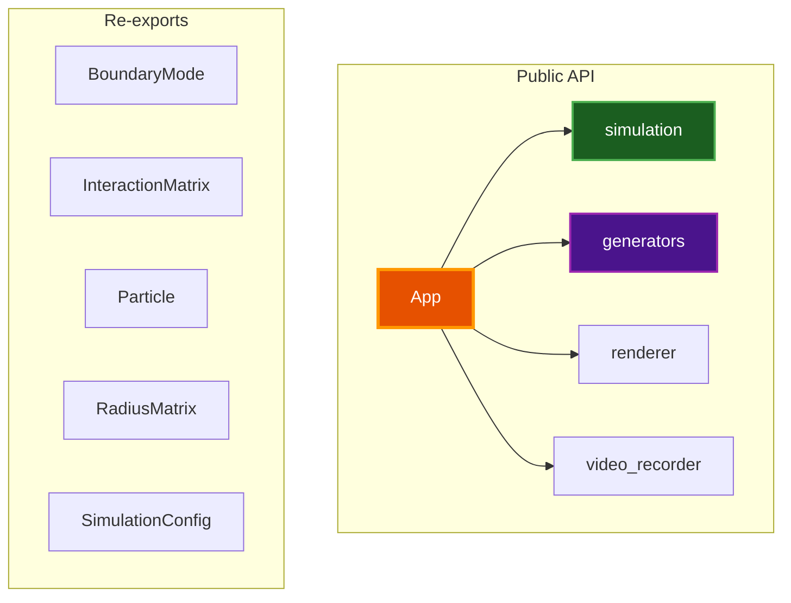

# API Documentation

Public API reference for the Par Particle Life library.

## Table of Contents
- [Overview](#overview)
- [Core Types](#core-types)
- [Simulation Module](#simulation-module)
- [Generators Module](#generators-module)
- [App Module](#app-module)
- [Renderer Module](#renderer-module)
- [Video Recording](#video-recording)
- [Related Documentation](#related-documentation)

## Overview

Par Particle Life exposes a public API for embedding particle simulations in Rust applications.

### Quick Start

```rust
use par_particle_life::app::App;

fn main() -> anyhow::Result<()> {
    // Run with UI sidebar visible
    App::run(false)
}
```

### Module Structure



## Core Types

### Re-exported Types

The following types are re-exported at the crate root:

```rust
pub use simulation::{
    BoundaryMode,
    InteractionMatrix,
    Particle,
    RadiusMatrix,
    SimulationConfig,
};
```

### Particle

Represents a single particle in the simulation.

```rust
pub struct Particle {
    pub x: f32,
    pub y: f32,
    pub vx: f32,
    pub vy: f32,
    pub particle_type: u32,
}

impl Particle {
    pub fn new(x: f32, y: f32, particle_type: u32) -> Self;
}
```

### InteractionMatrix

N×N matrix of interaction strengths between particle types.

```rust
pub struct InteractionMatrix {
    pub size: usize,
    pub data: Vec<f32>,
}

impl InteractionMatrix {
    pub fn new(size: usize) -> Self;
    pub fn get(&self, i: usize, j: usize) -> f32;
    pub fn set(&mut self, i: usize, j: usize, value: f32);
    pub fn symmetrize(&mut self);
    pub fn validate(&self) -> Result<(), String>;
}
```

### RadiusMatrix

Per-type-pair interaction radius configuration.

```rust
pub struct RadiusMatrix {
    pub size: usize,
    pub min_data: Vec<f32>,  // Minimum interaction radius
    pub max_data: Vec<f32>,  // Maximum interaction radius
}

impl RadiusMatrix {
    pub fn new(size: usize) -> Self;
    pub fn get_min(&self, i: usize, j: usize) -> f32;
    pub fn get_max(&self, i: usize, j: usize) -> f32;
    pub fn set_min(&mut self, i: usize, j: usize, value: f32);
    pub fn set_max(&mut self, i: usize, j: usize, value: f32);
}
```

### BoundaryMode

How particles interact with world boundaries.

```rust
#[derive(Debug, Clone, Copy, PartialEq, Eq, Serialize, Deserialize)]
pub enum BoundaryMode {
    Repel = 0,       // Bounce off walls
    Wrap = 1,        // Teleport to opposite side
    MirrorWrap = 2,  // Wrap with edge rendering
    InfiniteWrap = 3, // Dynamic tiling
}
```

### SimulationConfig

Complete simulation configuration.

```rust
pub struct SimulationConfig {
    pub num_particles: u32,
    pub num_types: u32,
    pub force_factor: f32,
    pub friction: f32,
    pub repel_strength: f32,
    pub max_velocity: f32,
    pub boundary_mode: BoundaryMode,
    pub wall_repel_strength: f32,
    pub mirror_wrap_count: u32,
    pub world_size: glam::Vec2,
    pub particle_size: f32,
    pub enable_glow: bool,
    pub glow_intensity: f32,
    pub glow_size: f32,
    pub glow_steepness: f32,
    pub use_spatial_hash: bool,
    pub spatial_hash_cell_size: f32,
    pub max_bin_density: f32,
    pub neighbor_budget: u32,
    pub background_color: [f32; 3],
}

impl SimulationConfig {
    pub fn default() -> Self;
    pub fn gpu_defaults() -> Self;
    pub fn validate(&self) -> Result<(), String>;
}
```

## Simulation Module

### PhysicsEngine

Manages particle physics simulation.

```rust
pub struct PhysicsEngine {
    // Internal state
}

impl PhysicsEngine {
    pub fn new(config: SimulationConfig) -> Self;
    pub fn step(&mut self, dt: f32);
    pub fn particles(&self) -> &[Particle];
    pub fn particles_mut(&mut self) -> &mut [Particle];
}
```

### SpatialHash

Spatial partitioning for O(n*k) neighbor queries.

```rust
pub struct SpatialHash {
    // Internal state
}

impl SpatialHash {
    pub fn new(cell_size: f32, width: f32, height: f32) -> Self;
    pub fn clear(&mut self);
    pub fn insert(&mut self, particle: &Particle, index: usize);
    pub fn query(&self, x: f32, y: f32, radius: f32) -> Vec<usize>;
}
```

## Generators Module

### Rule Generators

```rust
pub mod rules {
    pub enum RuleType {
        Random,
        Symmetric,
        Snake,
        // ... 28 more variants
    }

    impl RuleType {
        pub fn all() -> &'static [RuleType];
        pub fn display_name(&self) -> &'static str;
        pub fn category(&self) -> &'static str;
    }

    pub fn generate_rules(rule_type: RuleType, num_types: usize) -> InteractionMatrix;
}
```

### Color Palettes

```rust
pub mod colors {
    pub type Color = [f32; 4];

    pub enum PaletteType {
        Random,
        Rainbow,
        // ... 35 more variants
    }

    impl PaletteType {
        pub fn all() -> &'static [PaletteType];
        pub fn display_name(&self) -> &'static str;
        pub fn category(&self) -> &'static str;
    }

    pub fn generate_colors(palette: PaletteType, num_types: usize) -> Vec<Color>;
}
```

### Position Patterns

```rust
pub mod positions {
    pub struct SpawnConfig {
        pub num_particles: usize,
        pub num_types: usize,
        pub width: f32,
        pub height: f32,
    }

    pub enum PositionPattern {
        Random,
        Disk,
        // ... 26 more variants
    }

    impl PositionPattern {
        pub fn all() -> &'static [PositionPattern];
        pub fn display_name(&self) -> &'static str;
        pub fn category(&self) -> &'static str;
        pub fn required_types(&self) -> Option<usize>;
    }

    pub fn generate_positions(pattern: PositionPattern, config: &SpawnConfig) -> Vec<Particle>;
}
```

## App Module

### App

Main application entry point.

```rust
pub struct App {
    // Internal state
}

impl App {
    /// Run the application.
    ///
    /// # Arguments
    /// * `hide_ui` - If true, starts with sidebar hidden
    pub fn run(hide_ui: bool) -> anyhow::Result<()>;
}
```

### AppConfig

Application-level settings with persistence.

```rust
pub struct AppConfig {
    pub title: String,
    pub window_width: u32,
    pub window_height: u32,
    pub target_fps: u32,
    pub vsync: bool,
    // ... UI state fields
    // ... physics defaults
    // ... generator selections
}

impl AppConfig {
    pub fn default() -> Self;
    pub fn load() -> Self;
    pub fn save(&self) -> anyhow::Result<()>;
    pub fn config_dir() -> anyhow::Result<PathBuf>;
}
```

## Renderer Module

### GpuContext

wgpu device and queue management.

```rust
pub struct GpuContext {
    pub device: wgpu::Device,
    pub queue: wgpu::Queue,
    pub surface: wgpu::Surface,
    // ...
}

impl GpuContext {
    pub async fn new(window: &Window) -> anyhow::Result<Self>;
    pub fn resize(&mut self, width: u32, height: u32);
}
```

### SimulationBuffers

GPU buffer management for particle data.

```rust
pub struct SimulationBuffers {
    // Particle position/type buffers (double-buffered)
    // Velocity buffers
    // Interaction matrix buffer
    // Radius matrices
    // Color palette
}

impl SimulationBuffers {
    pub fn new(device: &wgpu::Device, config: &SimulationConfig) -> Self;
    pub fn upload_particles(&self, queue: &wgpu::Queue, particles: &[Particle]);
    pub fn swap_buffers(&mut self);
    pub fn current_buffer(&self) -> usize;
}
```

## Video Recording

### VideoRecorder

FFmpeg-based video recording.

```rust
pub enum VideoFormat {
    Mp4,
    WebM,
    Gif,
}

pub struct VideoRecorder {
    // Internal state
}

impl VideoRecorder {
    pub fn new(
        output_path: &Path,
        width: u32,
        height: u32,
        fps: u32,
        format: VideoFormat,
    ) -> anyhow::Result<Self>;

    pub fn add_frame(&mut self, rgba_data: &[u8]) -> anyhow::Result<()>;
    pub fn finish(self) -> anyhow::Result<PathBuf>;
    pub fn is_recording(&self) -> bool;
}
```

### Usage Example

```rust
use par_particle_life::video_recorder::{VideoRecorder, VideoFormat};

let mut recorder = VideoRecorder::new(
    Path::new("output.mp4"),
    1920,
    1080,
    60,
    VideoFormat::Mp4,
)?;

// In render loop:
recorder.add_frame(&frame_data)?;

// When done:
let output_path = recorder.finish()?;
```

## Related Documentation

- [ARCHITECTURE.md](ARCHITECTURE.md) - System architecture
- [GENERATORS.md](GENERATORS.md) - Generator reference
- [CONFIGURATION.md](CONFIGURATION.md) - Configuration options
- [SHADERS.md](SHADERS.md) - Shader documentation
