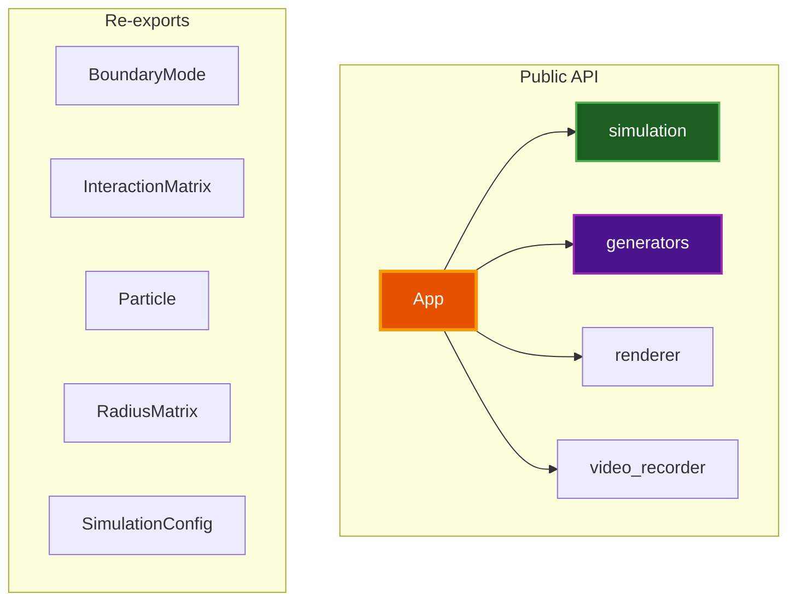

# API Documentation

Public API reference for the Par Particle Life library.

## Table of Contents
- [Overview](#overview)
- [Core Types](#core-types)
- [Simulation Module](#simulation-module)
- [Generators Module](#generators-module)
- [App Module](#app-module)
- [Renderer Module](#renderer-module)
- [Video Recording](#video-recording)
- [Related Documentation](#related-documentation)

## Overview

Par Particle Life exposes a public API for embedding particle simulations in Rust applications. The library (`App` and the `simulation` / `generators` / `renderer` modules) is **pure state plus simulation methods** — it does not depend on winit, egui, or a window, so it can be embedded headlessly (preset converters, property-based physics tests, headless render farms).

Running the interactive GUI is the **binary's** job (`src/main.rs`): it parses a single CLI flag, constructs an `AppHandler`, and drives the winit event loop. See [Command-Line Flags](#command-line-flags) below.

### Quick Start

Embed the library headlessly:

```rust
use par_particle_life::simulation::{Particle, SimulationConfig};

let config = SimulationConfig::default();
// inspect or mutate `config`, build `Particle` arrays, etc.
let _particle = Particle::new(100.0, 200.0, 0);
```

Launch the interactive GUI from a binary:

```rust
use par_particle_life::app::handler::AppHandler;
use winit::event_loop::{ControlFlow, EventLoop};

fn main() -> anyhow::Result<()> {
    let event_loop = EventLoop::new()?;
    event_loop.set_control_flow(ControlFlow::Poll);
    let mut handler = AppHandler::new(false); // pass true to wipe persisted config
    event_loop.run_app(&mut handler)?;
    Ok(())
}
```

The shipped binary parses the clap CLI flag `--reset-config` and forwards it to `AppHandler::new`; see `src/main.rs`.

### Module Structure


```mermaid
graph TB
    subgraph Public["Public API"]
        App[App]
        Simulation[simulation]
        Generators[generators]
        Renderer[renderer]
        Video[video_recorder]
    end

    subgraph ReExports["Re-exports"]
        BoundaryMode
        InteractionMatrix
        Particle
        RadiusMatrix
        SimulationConfig
    end

    App --> Simulation
    App --> Generators
    App --> Renderer
    App --> Video

    style App fill:#e65100,stroke:#ff9800,stroke-width:3px,color:#ffffff
    style Simulation fill:#1b5e20,stroke:#4caf50,stroke-width:2px,color:#ffffff
    style Generators fill:#4a148c,stroke:#9c27b0,stroke-width:2px,color:#ffffff
```

## Core Types

### Re-exported Types

The following types are re-exported at the crate root:

```rust
pub use simulation::{
    BoundaryMode,
    InteractionMatrix,
    Particle,
    RadiusMatrix,
    SimulationConfig,
};
```

### Particle

A single particle in the simulation. CPU-side interchange type only — never uploaded to the GPU as an AoS blob. The struct is `#[repr(C, align(16))]` and **32 bytes** (5 used fields = 20 bytes + 12 bytes of explicit tail padding to satisfy the 16-byte alignment). The byte size and field offsets are locked by `const _: () = assert!(...)` statements at the end of `particle.rs`.

```rust
#[derive(Debug, Clone, Copy, Pod, Zeroable)]
#[repr(C, align(16))]
pub struct Particle {
    pub x: f32,                  //  0
    pub y: f32,                  //  4
    pub vx: f32,                 //  8
    pub vy: f32,                 // 12
    pub particle_type: u32,      // 16
    pub _padding: [u32; 3],      // 20  (tail pad to 32-byte alignment)
}

impl Particle {
    pub fn new(x: f32, y: f32, particle_type: u32) -> Self;
}
```

> **Note:** The storage hot path on the GPU uses the SoA types `ParticlePosType`, `ParticleVel`, and `ParticleVelHalf` (re-exported from `simulation`), not `Particle` directly. `Particle` is the interchange type for generators and presets.

### InteractionMatrix

N×N matrix of interaction strengths between particle types.

```rust
pub struct InteractionMatrix {
    pub size: usize,
    pub data: Vec<f32>,
}

impl InteractionMatrix {
    pub fn new(size: usize) -> Self;
    pub fn get(&self, i: usize, j: usize) -> f32;
    pub fn set(&mut self, i: usize, j: usize, value: f32);
    pub fn symmetrize(&mut self);
    pub fn validate(&self) -> Result<(), String>;
}
```

### RadiusMatrix

Per-type-pair min/max interaction radii. Stored as two flat `size * size` row-major vectors; index `(i, j)` is `i * size + j`.

```rust
pub struct RadiusMatrix {
    pub min_radius: Vec<f32>,  // Minimum interaction radius per type pair
    pub max_radius: Vec<f32>,  // Maximum interaction radius per type pair
    pub size: usize,
}

impl RadiusMatrix {
    /// Fill every (i, j) with the same min/max pair.
    pub fn new(size: usize, min_radius: f32, max_radius: f32) -> Self;
    /// Defaults to (30.0, 80.0) pixels for every entry.
    pub fn default_for_size(size: usize) -> Self;
    pub fn get_min(&self, from_type: usize, to_type: usize) -> f32;
    pub fn get_max(&self, from_type: usize, to_type: usize) -> f32;
    /// Set both bounds for a single (from, to) pair in one call.
    pub fn set(&mut self, from_type: usize, to_type: usize, min: f32, max: f32);
}
```

### BoundaryMode

How particles interact with world boundaries.

```rust
#[derive(Debug, Clone, Copy, PartialEq, Eq, Serialize, Deserialize)]
pub enum BoundaryMode {
    Repel = 0,       // Bounce off walls
    Wrap = 1,        // Teleport to opposite side
    MirrorWrap = 2,  // Wrap with edge rendering
    InfiniteWrap = 3, // Dynamic tiling
}
```

### SimulationConfig

Complete simulation configuration. New fields added in 0.2 and 0.3 carry `#[serde(default)]`, so older preset JSON continues to load.

```rust
pub struct SimulationConfig {
    pub num_particles: u32,                 // 16 - 1,048,576
    pub num_types: u32,                     // 1 - 16
    pub force_factor: f32,                  // 0.1 - 10.0 (lower = stronger)
    pub friction: f32,                      // 0.0 - 1.0
    pub repel_strength: f32,
    pub max_velocity: f32,
    pub boundary_mode: BoundaryMode,
    pub wall_repel_strength: f32,           // 0.0 - 100.0 (Repel mode)
    pub mirror_wrap_count: u32,             // 5 or 9 (MirrorWrap mode)
    pub world_size: glam::Vec2,
    pub enable_3d: bool,
    pub depth_limit: f32,
    pub particle_size: f32,
    pub enable_glow: bool,
    pub glow_intensity: f32,
    pub glow_size: f32,
    pub glow_steepness: f32,
    pub use_spatial_hash: bool,             // forced true each frame; retained for schema compat
    pub spatial_hash_cell_size: f32,
    pub max_bin_density: f32,               // 0.2.0+
    pub neighbor_budget: u32,               // 0.2.0+ (0 = unlimited)
    pub background_color: [f32; 3],
    pub temperature: f32,                   // 0.2.0+ — Brownian noise (0.0 - 50.0)
    pub frame_counter: u32,                 // 0.2.0+ — GPU noise seed; incremented per frame
    pub time_scale: f32,                    // 0.3.0+ — slow-mo / fast-forward (0.1 - 5.0)
    pub velocity_coupling: f32,             // 0.3.0+ — boid-like alignment (0.0 - 1.0)
    pub integration_method: IntegrationMethod, // 0.3.0+ — Euler or Velocity Verlet
}

impl SimulationConfig {
    pub fn default() -> Self;
    pub fn gpu_defaults() -> Self;          // alias for default()
    pub fn validate(&self) -> Result<(), String>;
}
```

## Simulation Module

The project is **GPU-only**. There is no `PhysicsEngine` type and no CPU `step()` path — the force/advance work happens entirely in WGSL compute shaders driven by `AppHandler`. The `SpatialHash` type still exists for CPU-side tests and tooling, but the runtime spatial hash runs on the GPU.

### SpatialHash

Spatial partitioning for O(n*k) neighbor queries, used by CPU tooling and tests. The runtime simulation uses the GPU spatial-hash pipelines instead.

```rust
pub struct SpatialHash {
    // Internal state
}

impl SpatialHash {
    pub fn new(cell_size: f32, width: f32, height: f32) -> Self;
    pub fn clear(&mut self);
    pub fn insert(&mut self, particle: &Particle, index: usize);
    pub fn query(&self, x: f32, y: f32, radius: f32) -> Vec<usize>;
}
```

## Generators Module

The `generators` module is nested under the crate root (`pub mod generators`) and re-exports its public surface at the crate root for convenience. The actual file layout is `src/generators/{rules,colors,positions,custom,expression}.rs`:

```rust
// src/lib.rs
pub mod generators;
pub use app::App;
// ...

// src/generators/mod.rs
pub mod colors;
pub mod custom;        // Custom Generators (user JSON + expression DSL)
pub mod expression;    // Expr, ExprError, EvalContext
pub mod positions;
pub mod rules;

pub use colors::{ColorPalette, PaletteType};
pub use custom::CustomGenerator;
pub use expression::{EvalContext, Expr, ExprError};
pub use positions::{PositionPattern, SpawnConfig};
pub use rules::{RuleGenerator, RuleType};
```

### Rule Generators

```rust
pub mod generators::rules {
    pub enum RuleType {
        Random,
        Symmetric,
        Snake,
        // ... 31 more variants — 34 total
        // 0.3.0 additions: BlockDiagonal, CyclicPursuit, RandomSparse
    }

    impl RuleType {
        pub fn all() -> &'static [RuleType];        // 34 entries
        pub fn display_name(&self) -> &'static str;
        pub fn category(&self) -> &'static str;
    }

    pub fn generate_rules(rule_type: RuleType, num_types: usize) -> InteractionMatrix;
}
```

### Color Palettes

```rust
pub mod generators::colors {
    pub type Color = [f32; 4];

    pub enum PaletteType {
        Random,
        Rainbow,
        // ... 35 more variants — 37 total
    }

    impl PaletteType {
        pub fn all() -> &'static [PaletteType];        // 37 entries
        pub fn display_name(&self) -> &'static str;
        pub fn category(&self) -> &'static str;
    }

    pub fn generate_colors(palette: PaletteType, num_types: usize) -> Vec<Color>;
}
```

### Position Patterns

```rust
pub mod generators::positions {
    pub struct SpawnConfig {
        pub num_particles: usize,
        pub num_types: usize,
        pub width: f32,
        pub height: f32,
    }

    pub enum PositionPattern {
        Random,
        Disk,
        // ... 29 more variants — 31 total
        // 0.3.0 additions: LinearGradient, RadialGradient, AngularGradient
    }

    impl PositionPattern {
        pub fn all() -> &'static [PositionPattern];    // 31 entries
        pub fn display_name(&self) -> &'static str;
        pub fn category(&self) -> &'static str;
        pub fn required_types(&self) -> Option<usize>;
    }

    pub fn generate_positions(pattern: PositionPattern, config: &SpawnConfig) -> Vec<Particle>;
}
```

### Custom Generators

User-defined rule generators loaded from JSON files in the platform data directory. Each file specifies a display name and an expression written in the embedded DSL (`generators::expression`) that computes the interaction strength for a `(i, j)` pair. See [GENERATORS.md](GENERATORS.md) for the grammar (precedence, no `^`, div/mod-by-zero → 0, unseeded `random()`).

```rust
pub mod generators::custom {
    pub struct CustomGenerator { /* name, expr, size, ... */ }

    impl CustomGenerator {
        pub fn from_json(...) -> anyhow::Result<Self>;
        pub fn generate(&self, num_types: usize) -> InteractionMatrix;
    }
}

pub mod generators::expression {
    pub struct Expr { /* parsed AST */ }

    impl Expr {
        pub fn parse(source: &str) -> Result<Self, ExprError>;
        pub fn eval(&self, ctx: &EvalContext) -> Result<f32, ExprError>;
    }

    pub struct EvalContext {
        pub i: usize,     // row type index
        pub j: usize,     // column type index
        pub n: usize,     // total type count
    }

    pub enum ExprError { /* Parse(String), Eval(String), ... */ }
}
```

## App Module

### App

Pure simulation state plus the methods that drive it. `App` is **embeddable headlessly** — it has no winit/egui dependency. The interactive GUI lives one layer up in `app::handler::AppHandler`, which is constructed by the binary (`src/main.rs::run_app`).

```rust
pub struct App {
    pub sim_config: SimulationConfig,
    pub interaction_matrix: InteractionMatrix,
    pub radius_matrix: RadiusMatrix,
    pub colors: Vec<[f32; 4]>,
    pub particles: Vec<Particle>,
    pub obstacles: Vec<Obstacle>,
    // ... additional state for time-varying matrices, type overrides, etc.
}

impl App {
    pub fn new(reset_config: bool) -> Self;
    /// (De)serialize the persisted AppConfig from disk; `reset_config=true` replaces it with defaults.
}

// There is intentionally no App::run(). Running the GUI is the binary's job:
//
//   let mut handler = AppHandler::new(false);
//   event_loop.run_app(&mut handler)?;
//
// See src/main.rs and the crate-level doctest in src/lib.rs.
```

### AppHandler (binary entry point)

Platform layer that binds wgpu + egui + winit to `App`. Defined in `src/app/handler/mod.rs` and re-exported as `par_particle_life::app::handler::AppHandler`. The binary constructs one of these and drives it via `winit::ApplicationHandler::run_app`.

```rust
pub struct AppHandler { /* winit window, GPU context, egui state, App */ }

impl AppHandler {
    /// `reset_config == true` wipes the persisted AppConfig on startup.
    pub fn new(reset_config: bool) -> Self;
}
```

### Command-Line Flags

The binary (`src/main.rs`) uses clap and exposes a single flag:

| Flag | Type | Default | Description |
|------|------|---------|-------------|
| `--reset-config` | `bool` | `false` | Reset persisted `AppConfig` to defaults on startup, then run normally. Use this if a corrupted config prevents launch. |

There is no library-level CLI; the flag is parsed only by the shipped `par-particle-life` binary.

### AppConfig

Application-level settings with persistence.

```rust
pub struct AppConfig {
    pub title: String,
    pub window_width: u32,
    pub window_height: u32,
    pub target_fps: u32,
    pub vsync: bool,
    // ... UI state fields
    // ... physics defaults
    // ... generator selections
}

impl AppConfig {
    pub fn default() -> Self;
    pub fn load() -> Self;
    pub fn save(&self) -> anyhow::Result<()>;
    pub fn config_dir() -> anyhow::Result<PathBuf>;
}
```

## Renderer Module

### GpuContext

wgpu device and queue management.

```rust
pub struct GpuContext {
    pub device: wgpu::Device,
    pub queue: wgpu::Queue,
    pub surface: wgpu::Surface,
    // ...
}

impl GpuContext {
    pub async fn new(window: &Window) -> anyhow::Result<Self>;
    pub fn resize(&mut self, width: u32, height: u32);
}
```

### SimulationBuffers

GPU buffer management for particle data.

```rust
pub struct SimulationBuffers {
    // Particle position/type buffers (double-buffered)
    // Velocity buffers
    // Interaction matrix buffer
    // Radius matrices
    // Color palette
}

impl SimulationBuffers {
    pub fn new(device: &wgpu::Device, config: &SimulationConfig) -> Self;
    pub fn upload_particles(&self, queue: &wgpu::Queue, particles: &[Particle]);
    pub fn swap_buffers(&mut self);
    pub fn current_buffer(&self) -> usize;
}
```

## Video Recording

### VideoRecorder

FFmpeg-based video recording.

```rust
pub enum VideoFormat {
    Mp4,
    WebM,
    Gif,
}

pub struct VideoRecorder {
    // Internal state
}

impl VideoRecorder {
    pub fn new(
        output_path: &Path,
        width: u32,
        height: u32,
        fps: u32,
        format: VideoFormat,
    ) -> anyhow::Result<Self>;

    pub fn add_frame(&mut self, rgba_data: &[u8]) -> anyhow::Result<()>;
    pub fn finish(self) -> anyhow::Result<PathBuf>;
    pub fn is_recording(&self) -> bool;
}
```

### Usage Example

```rust
use par_particle_life::video_recorder::{VideoRecorder, VideoFormat};

let mut recorder = VideoRecorder::new(
    Path::new("output.mp4"),
    1920,
    1080,
    60,
    VideoFormat::Mp4,
)?;

// In render loop:
recorder.add_frame(&frame_data)?;

// When done:
let output_path = recorder.finish()?;
```

## Related Documentation

- [ARCHITECTURE.md](ARCHITECTURE.md) - System architecture
- [GENERATORS.md](GENERATORS.md) - Generator reference
- [CONFIGURATION.md](CONFIGURATION.md) - Configuration options
- [SHADERS.md](SHADERS.md) - Shader documentation
