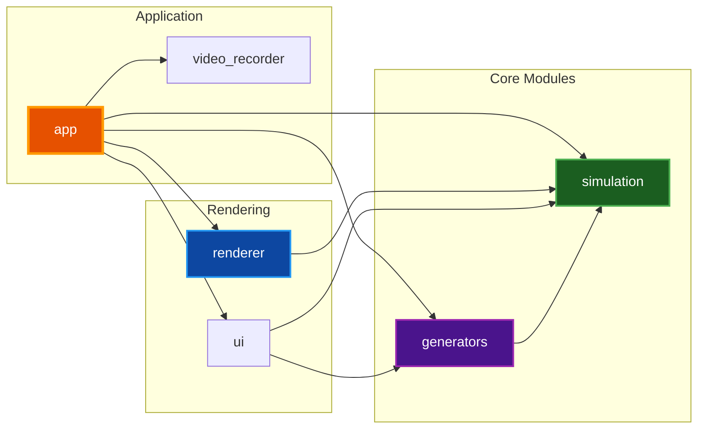
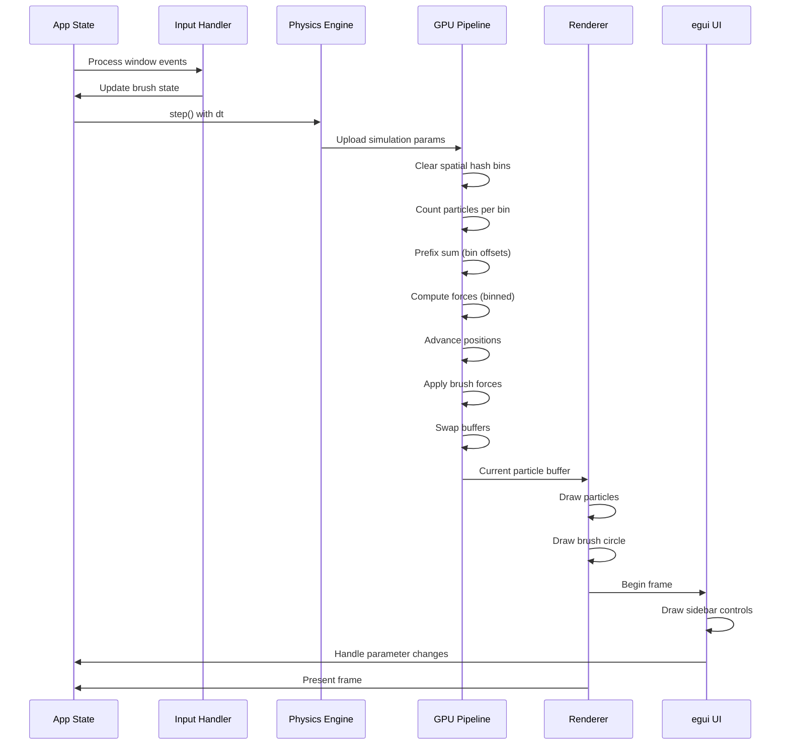
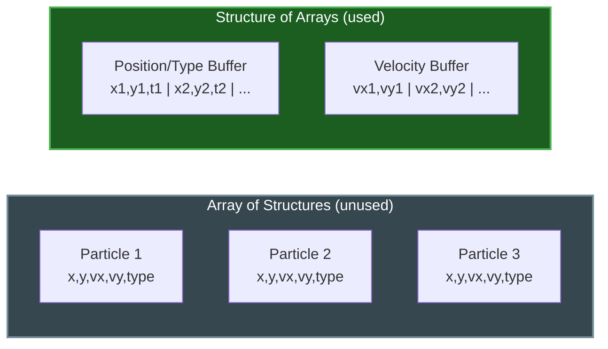
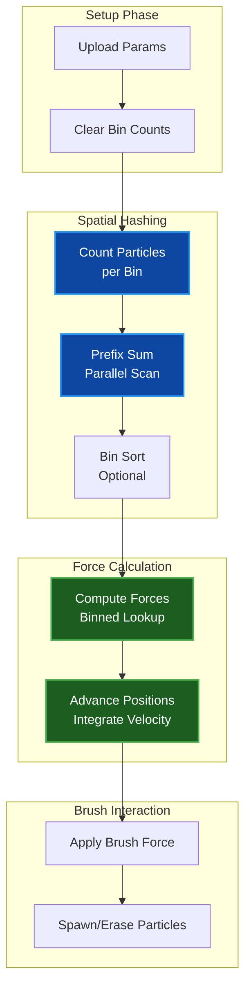
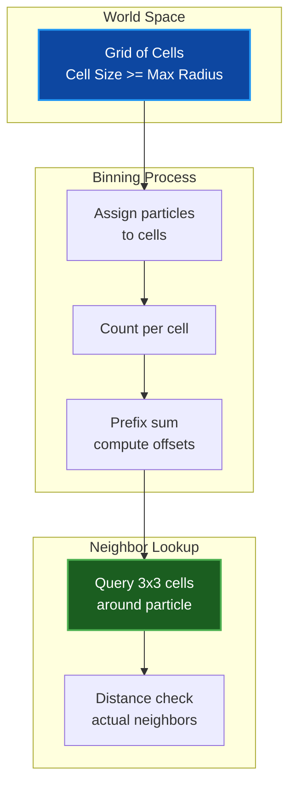
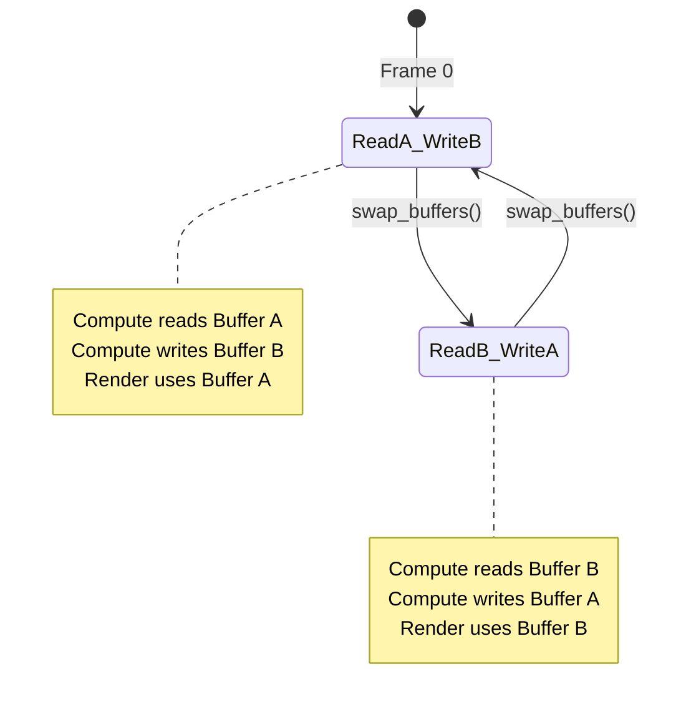
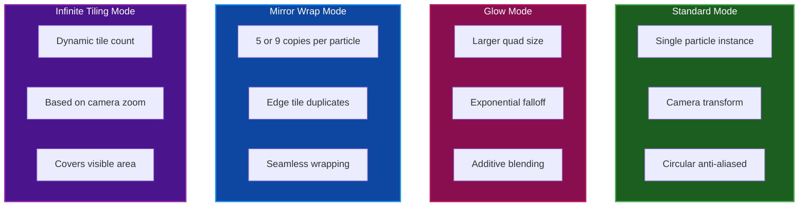

# Architecture Guide

Technical architecture documentation for Par Particle Life, covering system design, data flow, and implementation patterns.

## Table of Contents
- [Overview](#overview)
- [System Architecture](#system-architecture)
- [Module Structure](#module-structure)
- [Data Flow](#data-flow)
- [GPU Pipeline](#gpu-pipeline)
- [Spatial Hashing](#spatial-hashing)
- [Double-Buffering Pattern](#double-buffering-pattern)
- [Generator System](#generator-system)
- [Rendering Pipeline](#rendering-pipeline)
- [Related Documentation](#related-documentation)

## Overview

Par Particle Life is a GPU-accelerated particle simulation built with Rust. The architecture follows a modular design with clear separation between:

- **Application Layer**: Window management, input handling, UI
- **Simulation Core**: Physics engine, particle data, spatial optimization
- **GPU Rendering**: wgpu context, compute shaders, render pipelines
- **Generators**: Procedural content creation for rules, colors, and positions

## System Architecture

```mermaid
graph TB
    subgraph Application["Application Layer"]
        Main[Main Entry]
        App[App State]
        Input[Input Handler]
        UI[egui UI]
        Config[Config Manager]
        Presets[Preset System]
    end

    subgraph Simulation["Simulation Core"]
        Physics[Physics Engine]
        Particles[Particle Data]
        Matrix[Interaction Matrix]
        Radius[Radius Matrix]
        Spatial[Spatial Hash]
        Boundary[Boundary Handler]
    end

    subgraph GPU["GPU Rendering Layer"]
        Context[wgpu Context]
        Buffers[GPU Buffers]
        SimBuffers[Simulation Buffers]
        SpatialBuffers[Spatial Hash Buffers]
        Pipelines[Pipeline Manager]
        ComputePipelines[Compute Pipelines]
        RenderPipelines[Render Pipelines]
    end

    subgraph Generators["Generator System"]
        Rules[Rule Generators<br/>31 types]
        Colors[Color Palettes<br/>37 types]
        Positions[Spawn Patterns<br/>28 types]
    end

    subgraph Media["Media Output"]
        Video[Video Recorder]
        Screenshot[Screenshot]
    end

    Main --> App
    App --> Input
    App --> UI
    App --> Config
    App --> Presets
    App --> Physics
    App --> Context
    App --> Video

    Physics --> Particles
    Physics --> Matrix
    Physics --> Radius
    Physics --> Spatial
    Physics --> Boundary
    Physics --> ComputePipelines

    Rules --> Matrix
    Colors --> Particles
    Positions --> Particles

    Context --> Buffers
    Buffers --> SimBuffers
    Buffers --> SpatialBuffers
    Context --> Pipelines
    Pipelines --> ComputePipelines
    Pipelines --> RenderPipelines

    style Main fill:#e65100,stroke:#ff9800,stroke-width:3px,color:#ffffff
    style App fill:#e65100,stroke:#ff9800,stroke-width:3px,color:#ffffff
    style Physics fill:#1b5e20,stroke:#4caf50,stroke-width:2px,color:#ffffff
    style Particles fill:#1b5e20,stroke:#4caf50,stroke-width:2px,color:#ffffff
    style Spatial fill:#1b5e20,stroke:#4caf50,stroke-width:2px,color:#ffffff
    style Context fill:#0d47a1,stroke:#2196f3,stroke-width:2px,color:#ffffff
    style Buffers fill:#0d47a1,stroke:#2196f3,stroke-width:2px,color:#ffffff
    style ComputePipelines fill:#1a237e,stroke:#3f51b5,stroke-width:2px,color:#ffffff
    style RenderPipelines fill:#1a237e,stroke:#3f51b5,stroke-width:2px,color:#ffffff
    style Rules fill:#4a148c,stroke:#9c27b0,stroke-width:2px,color:#ffffff
    style Colors fill:#4a148c,stroke:#9c27b0,stroke-width:2px,color:#ffffff
    style Positions fill:#4a148c,stroke:#9c27b0,stroke-width:2px,color:#ffffff
    style Video fill:#880e4f,stroke:#c2185b,stroke-width:2px,color:#ffffff
```



## Module Structure

### Directory Layout

```
src/
├── main.rs              # CLI entry point
├── lib.rs               # Library root, public exports
├── app/
│   ├── mod.rs           # App module exports
│   ├── state.rs         # Core App struct and simulation state
│   ├── config.rs        # Persistent configuration
│   ├── preset.rs        # Save/load simulation states
│   ├── input.rs         # Brush and camera state
│   ├── gpu_state.rs     # GPU context and bind group caching
│   └── handler/         # Event loop and rendering (modular)
│       ├── mod.rs       # AppHandler struct definition
│       ├── events.rs    # winit ApplicationHandler impl
│       ├── init.rs      # GPU initialization
│       ├── update.rs    # Main update loop
│       ├── render.rs    # Frame rendering
│       ├── gpu_compute.rs    # GPU compute dispatch
│       ├── buffer_sync.rs    # CPU/GPU buffer synchronization
│       ├── ui.rs        # egui sidebar implementation
│       ├── brush.rs     # Brush tool operations
│       ├── recording.rs # Video/screenshot capture
│       └── presets_ops.rs    # Preset save/load operations
├── simulation/
│   ├── mod.rs           # Simulation exports, SimulationConfig
│   ├── particle.rs      # Particle, InteractionMatrix, RadiusMatrix
│   ├── physics.rs       # PhysicsEngine, force calculation
│   ├── spatial_hash.rs  # Spatial partitioning optimization
│   ├── boundary.rs      # Boundary mode implementations
│   └── game_of_life.rs  # Alternative simulation mode
├── generators/
│   ├── mod.rs           # Generator exports
│   ├── rules.rs         # 31 interaction matrix generators
│   ├── colors.rs        # 37 color palette generators
│   └── positions.rs     # 28 spawn pattern generators
├── renderer/
│   ├── mod.rs           # Renderer exports
│   └── gpu/
│       ├── mod.rs       # GPU module exports
│       ├── context.rs   # wgpu device, queue, surface
│       ├── buffers.rs   # GPU buffer management
│       └── pipelines/   # Pipeline management (modular)
│           ├── mod.rs       # CameraUniform, shader loader, re-exports
│           ├── compute.rs   # Force and advance compute pipelines
│           ├── render.rs    # Particle visualization render pipelines
│           ├── spatial.rs   # Spatial hashing optimization pipelines
│           └── brush.rs     # Brush interaction pipelines
├── utils/
│   ├── mod.rs           # Utility exports
│   ├── color.rs         # Color conversion utilities
│   └── math.rs          # Math utilities
└── video_recorder.rs    # ffmpeg-based video recording
```

### Module Dependencies



## Data Flow

### Frame Update Cycle



### Particle Data Layout

Particles use a Structure of Arrays (SoA) layout for GPU efficiency:



**Benefits of SoA layout:**
- Better GPU cache utilization (coalesced memory access)
- Separate buffers allow independent precision (F16 for velocity)
- Cleaner double-buffering implementation

## GPU Pipeline

### Compute Pipeline Stages



### Shader Files

| Shader | Purpose |
|--------|---------|
| `particle_forces.wgsl` | O(n²) brute-force force calculation |
| `particle_forces_binned.wgsl` | O(n*k) spatially-optimized forces |
| `particle_advance.wgsl` | Velocity/position integration |
| `particle_render.wgsl` | Standard particle rendering |
| `particle_render_glow.wgsl` | Glow effect rendering |
| `particle_render_mirror.wgsl` | Mirror wrap rendering (5/9 copies) |
| `particle_render_infinite.wgsl` | Infinite tiling rendering |
| `bin_clear.wgsl` | Zero spatial hash bins |
| `bin_count.wgsl` | Count particles per bin |
| `bin_prefix_sum.wgsl` | Parallel prefix sum |
| `bin_sort.wgsl` | Sort particles by bin |
| `brush_circle.wgsl` | Render brush indicator |
| `brush_force.wgsl` | Apply attract/repel forces |

## Spatial Hashing

Spatial hashing reduces force calculation from O(n²) to O(n*k) where k is the average number of neighbors.

### How It Works



**Key constraints:**
- Cell size must be >= maximum interaction radius
- A 3x3 neighborhood guarantees all potential neighbors are checked
- Default cell size: 100 world units

### Prefix Sum Algorithm

The prefix sum computes cumulative bin offsets in O(log n) parallel steps:

```text
Initial counts: [3, 1, 4, 2, 5]
After step 1:   [3, 4, 5, 6, 9]  (add element i-1)
After step 2:   [3, 4, 8, 10, 14] (add element i-2)
Final offsets:  [0, 3, 4, 8, 10, 15] (shift right, prepend 0)
```

## Double-Buffering Pattern

To avoid race conditions in compute shaders, particle buffers use ping-pong double-buffering:



**Implementation:**
- `current_buffer` index (0 or 1)
- `current_pos_type()` returns read buffer
- `next_pos_type()` returns write buffer
- `swap_buffers()` toggles index after compute pass

## Generator System

### Generator Types

```mermaid
graph TB
    subgraph Rules["Rule Generators (31)"]
        RulesEnum[RuleType Enum]
        RulesGen[generate_rules fn]
        Matrix[InteractionMatrix]
    end

    subgraph Colors["Color Generators (37)"]
        ColorsEnum[PaletteType Enum]
        ColorsGen[generate_colors fn]
        Palette["Vec<[f32; 4]>"]
    end

    subgraph Positions["Position Generators (28)"]
        PosEnum[PositionPattern Enum]
        PosGen[generate_positions fn]
        Particles["Vec<Particle>"]
    end

    RulesEnum --> RulesGen
    RulesGen --> Matrix

    ColorsEnum --> ColorsGen
    ColorsGen --> Palette

    PosEnum --> PosGen
    PosGen --> Particles

    style RulesGen fill:#4a148c,stroke:#9c27b0,stroke-width:2px,color:#ffffff
    style ColorsGen fill:#4a148c,stroke:#9c27b0,stroke-width:2px,color:#ffffff
    style PosGen fill:#4a148c,stroke:#9c27b0,stroke-width:2px,color:#ffffff
```



### Generator Pattern

Each generator type follows the same pattern:

```rust
// 1. Enum with all variants
pub enum RuleType {
    Random,
    Symmetric,
    Snake,
    // ... 28 more
}

// 2. Static list of all variants
impl RuleType {
    pub fn all() -> &'static [RuleType] { /* ... */ }
    pub fn display_name(&self) -> &'static str { /* ... */ }
}

// 3. Generation function
pub fn generate_rules(rule_type: RuleType, num_types: usize) -> InteractionMatrix {
    match rule_type {
        RuleType::Random => random_generator(num_types),
        // ...
    }
}
```

## Rendering Pipeline

### Render Modes



### Instanced Rendering

Particles render using GPU instancing:

1. **Vertex shader** receives instance index
2. Looks up particle position/type from storage buffer
3. Transforms quad vertices to screen space
4. Passes color and UV to fragment shader

5. **Fragment shader** calculates distance from quad center
6. Applies smooth anti-aliased circle with `smoothstep`
7. Discards pixels outside radius

## Related Documentation

- [README.md](../README.md) - Project overview and usage
- [SHADERS.md](SHADERS.md) - Detailed shader documentation
- [GENERATORS.md](GENERATORS.md) - Generator reference
- [CONFIGURATION.md](CONFIGURATION.md) - Configuration options
