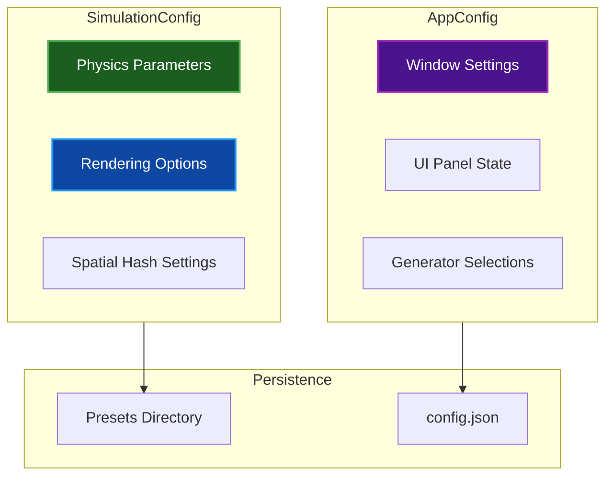
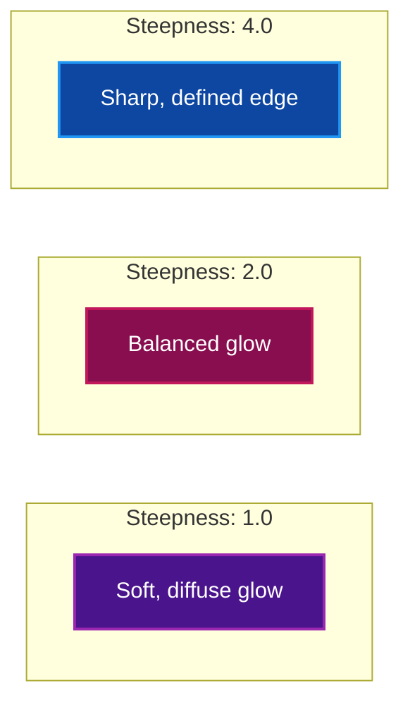

# Configuration Guide

Complete reference for all configuration options in Par Particle Life.

## Table of Contents
- [Overview](#overview)
- [Simulation Parameters](#simulation-parameters)
- [Physics Settings](#physics-settings)
- [Rendering Options](#rendering-options)
- [Boundary Modes](#boundary-modes)
- [Performance Tuning](#performance-tuning)
- [Application Settings](#application-settings)
- [Configuration Files](#configuration-files)
- [Related Documentation](#related-documentation)

## Overview

Configuration is split into two main structures:

| Structure | Purpose | Persistence |
|-----------|---------|-------------|
| `SimulationConfig` | Physics and rendering parameters | Per-session / Presets |
| `AppConfig` | Application preferences | Saved to disk |



## Simulation Parameters

### Core Parameters

| Parameter | Type | Default | Range | Description |
|-----------|------|---------|-------|-------------|
| `num_particles` | u32 | 64,000 | 16 - 1,048,576 | Total particle count |
| `num_types` | u32 | 7 | 1 - 16 | Number of particle species |
| `world_size` | Vec2 | (1920, 1080) | > 0 | World dimensions in pixels |

### Interaction Matrix

The interaction matrix defines how particle types affect each other:

```text
           Type 0  Type 1  Type 2
Type 0  [  0.5    -0.3     0.8  ]
Type 1  [  0.2     0.0    -0.5  ]
Type 2  [ -0.7     0.6     0.1  ]
```

Values range from -1.0 (strong repulsion) to 1.0 (strong attraction).

### Radius Configuration

Each type pair has min/max radius values:

| Parameter | Default | Description |
|-----------|---------|-------------|
| `min_radius` | 10 | Distance where repulsion begins |
| `max_radius` | 100 | Maximum interaction distance |

## Physics Settings

### Force Parameters

| Parameter | Default | Range | Description |
|-----------|---------|-------|-------------|
| `force_factor` | 1.0 | 0.1 - 10.0 | Global force multiplier (lower = stronger) |
| `friction` | 0.3 | 0.0 - 1.0 | Velocity damping per frame |
| `repel_strength` | 3.0 | 0.01 - 4.0 | Close-range repulsion intensity |
| `max_velocity` | 500.0 | > 0 | Maximum particle speed |

### Force Calculation

Forces are computed using:

```text
if distance < min_radius:
    force = (distance / min_radius - 1.0) * repel_strength  # Repulsion
else:
    force = interaction_strength * (1.0 - |distance - mid| / half_range)  # Attraction/Repulsion
```

### Force Factor Effect

| Value | Effect |
|-------|--------|
| 0.1 | Very strong forces, chaotic |
| 1.0 | Balanced (default) |
| 5.0 | Gentle forces, slow movement |
| 10.0 | Very weak forces |

### Friction Effect

| Value | Effect |
|-------|--------|
| 0.0 | No damping, perpetual motion |
| 0.1 | Light damping, fluid behavior |
| 0.3 | Default, good stability |
| 0.5 | Heavy damping, viscous |
| 0.9 | Very sluggish movement |

## Rendering Options

### Particle Appearance

| Parameter | Default | Range | Description |
|-----------|---------|-------|-------------|
| `particle_size` | 0.5 | 0.1 - 10.0 | Particle render size in pixels |
| `background_color` | [0,0,0] | [0-1, 0-1, 0-1] | RGB background color |

### Glow Effect

| Parameter | Default | Range | Description |
|-----------|---------|-------|-------------|
| `enable_glow` | true | bool | Enable glow rendering |
| `glow_intensity` | 0.35 | 0.0 - 2.0 | Glow brightness |
| `glow_size` | 4.0 | 2.0 - 8.0 | Quad size multiplier |
| `glow_steepness` | 2.0 | 1.0 - 4.0 | Falloff sharpness |

### Glow Visualization



## Boundary Modes

### Available Modes

| Mode | Description | Use Case |
|------|-------------|----------|
| **Repel** | Particles bounce off walls | Contained simulations |
| **Wrap** | Teleport to opposite edge | Infinite plane illusion |
| **MirrorWrap** | Wrap + edge rendering | Seamless tiling |
| **InfiniteWrap** | Dynamic tiling with camera | Exploration mode |

### Mode-Specific Settings

#### Repel Mode

| Parameter | Default | Range | Description |
|-----------|---------|-------|-------------|
| `wall_repel_strength` | 100.0 | 0 - 100 | Wall bounce force |

#### MirrorWrap Mode

| Parameter | Default | Options | Description |
|-----------|---------|---------|-------------|
| `mirror_wrap_count` | 5 | 5, 9 | Number of edge copies |

**5 copies:** Center + 4 edges (efficient)
**9 copies:** Center + 4 edges + 4 corners (seamless)

## Performance Tuning

### Spatial Hashing

| Parameter | Default | Range | Description |
|-----------|---------|-------|-------------|
| `use_spatial_hash` | true | bool | Enable O(n*k) optimization |
| `spatial_hash_cell_size` | 64.0 | > 0 | Grid cell size |

> **Note:** Cell size must be >= maximum interaction radius for correct physics.

### Density Management

| Parameter | Default | Range | Description |
|-----------|---------|-------|-------------|
| `max_bin_density` | 5000.0 | 0 - 10000 | Force scaling threshold |
| `neighbor_budget` | 0 | 0 = unlimited | Max neighbors checked per particle |

**When particles cluster heavily:**
- `max_bin_density`: Scales forces down in dense regions
- `neighbor_budget`: Caps iterations, maintaining frame rate

### Performance Recommendations

| Particle Count | Cell Size | Neighbor Budget |
|----------------|-----------|-----------------|
| < 50,000 | 64-100 | 0 (unlimited) |
| 50,000 - 200,000 | 80-120 | 500-1000 |
| > 200,000 | 100-150 | 200-500 |

## Application Settings

### Window Configuration

| Parameter | Default | Description |
|-----------|---------|-------------|
| `title` | "Par Particle Life" | Window title |
| `window_width` | 1920 | Initial window width |
| `window_height` | 1080 | Initial window height |
| `target_fps` | 60 | Target frame rate |
| `vsync` | false | Enable vertical sync |

### UI State

The application remembers which UI panels are open/closed:

| Parameter | Default | Description |
|-----------|---------|-------------|
| `ui_simulation_open` | true | Simulation panel |
| `ui_physics_open` | true | Physics panel |
| `ui_generators_open` | true | Generators panel |
| `ui_interaction_matrix_open` | false | Matrix editor |
| `ui_brush_tools_open` | true | Brush tools |
| `ui_rendering_open` | false | Rendering options |
| `ui_presets_open` | false | Presets panel |
| `ui_keyboard_shortcuts_open` | false | Shortcuts help |

### Generator Defaults

| Parameter | Default | Description |
|-----------|---------|-------------|
| `gen_rule` | Random | Default rule generator |
| `gen_palette` | Rainbow | Default color palette |
| `gen_pattern` | Disk | Default spawn pattern |

## Configuration Files

### Locations

Configuration files are stored in platform-specific directories:

| Platform | Path |
|----------|------|
| **Linux** | `~/.config/par-particle-life/` |
| **macOS** | `~/Library/Application Support/par-particle-life/` |
| **Windows** | `%APPDATA%\par-particle-life\` |

### File Structure

```text
par-particle-life/
├── config.json      # Application settings
└── presets/
    ├── MyPreset.json
    └── AnotherPreset.json
```

### Config File Format

```json
{
  "title": "Par Particle Life",
  "window_width": 1920,
  "window_height": 1080,
  "vsync": false,
  "phys_force_factor": 1.0,
  "phys_friction": 0.3,
  "phys_boundary_mode": "Wrap",
  "sim_num_particles": 64000,
  "sim_num_types": 7,
  "gen_rule": "Random",
  "gen_palette": "Rainbow",
  "gen_pattern": "Disk",
  "render_particle_size": 0.5,
  "render_glow_enabled": true
}
```

### Preset File Format

Presets store the complete simulation state:

```json
{
  "name": "My Simulation",
  "config": { /* SimulationConfig */ },
  "interaction_matrix": { /* InteractionMatrix */ },
  "radius_matrix": { /* RadiusMatrix */ },
  "colors": [[r, g, b, a], ...],
  "particles": [{ "x": 100.0, "y": 200.0, ... }, ...]
}
```

## Related Documentation

- [ARCHITECTURE.md](ARCHITECTURE.md) - System architecture
- [GENERATORS.md](GENERATORS.md) - Generator reference
- [SHADERS.md](SHADERS.md) - Shader documentation
- [README.md](../README.md) - Project overview
