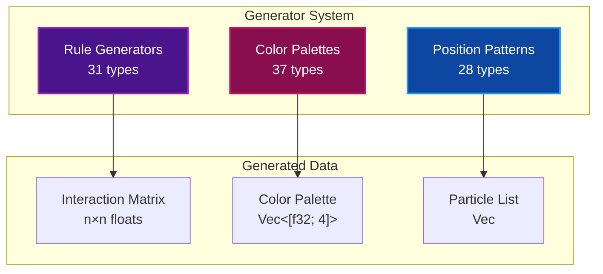
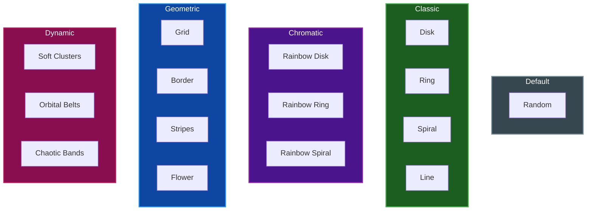

# Generator Reference

Complete reference for all particle generators in Par Particle Life, including interaction rules, color palettes, and spawn patterns.

## Table of Contents
- [Overview](#overview)
- [Rule Generators](#rule-generators)
- [Color Palettes](#color-palettes)
- [Position Patterns](#position-patterns)
- [Generator API](#generator-api)
- [Related Documentation](#related-documentation)

## Overview

Generators create the initial state of a particle simulation through three independent systems:



Each generator type follows a consistent pattern:
1. **Enum** with all variants
2. **`all()`** method returning available types
3. **`display_name()`** for UI labels
4. **`generate()`** function producing the data

## Rule Generators

Rule generators create interaction matrices that define how particle types attract or repel each other.

### Matrix Values

| Value | Meaning |
|-------|---------|
| `1.0` | Strong attraction |
| `0.0` | No interaction |
| `-1.0` | Strong repulsion |

### Available Rules (31)

#### Default

| Name | Description |
|------|-------------|
| **Random** | Random values in [-1, 1] for each pair |

#### Symmetric Patterns

| Name | Description |
|------|-------------|
| **Symmetric** | Random matrix where m[i][j] = m[j][i] |

#### Chain-Based

| Name | Description |
|------|-------------|
| **Snake** | Each type follows the next in sequence |
| **Chains 1** | Strong attraction to self and neighbors, repel others |
| **Chains 2** | Self-attraction, weak neighbor attraction, repel others |
| **Chains 3** | Like Chains 2 but neutral to distant types |

#### Game Theory

| Name | Description |
|------|-------------|
| **Rock–Paper–Scissors** | Cyclic dominance: A chases B, B chases C, C chases A |
| **Bipartite Alliances** | Two groups with internal attraction, mutual repulsion |

#### Spatial Patterns

| Name | Description |
|------|-------------|
| **Hub and Spokes** | Type 0 is central hub attracting all others |
| **Concentric Shells** | Nested ring structure with decreasing attraction |
| **Dimers & Chains** | Paired types (0↔1, 2↔3) with strong bonds |
| **Triad Flocks** | Groups of 3 types that attract each other |

#### Wave-Based

| Name | Description |
|------|-------------|
| **Wavefield** | Sinusoidal pattern based on type distance |
| **Biased Wave** | Wave with DC offset for net attraction |
| **Chiral Bandpass** | Complex wave with multiple harmonics |
| **Tri-Spiral** | Triple harmonic spiral pattern |

#### Rotational

| Name | Description |
|------|-------------|
| **Anti-symmetric Swirl** | Creates rotational particle motion |
| **Spiral Conveyor** | Spiral formations with conveyor belt motion |
| **Rotating Conveyor** | Twisted spiral with rotation |
| **Vortex–Antivortex** | Alternating rotation pattern |

#### Mathematical

| Name | Description |
|------|-------------|
| **Prime Hop** | Pattern based on prime number spacing |
| **Parity Vortex** | Even/odd based interactions |
| **Helical Ladder** | Double helix pattern using trig functions |
| **Modular Triads** | Mod-3 grouping creates cyclic dynamics |
| **Golden Angle Jitter** | Based on golden ratio angular distribution |

#### Complex Patterns

| Name | Description |
|------|-------------|
| **Checker Offsets** | Alternating attraction/repulsion pattern |
| **Patchwork** | Deterministic pseudo-random mosaic |
| **Skipped Pursuit** | Types chase types K steps ahead |
| **Blue-Noise Conveyor** | Noise-based asymmetric drift |
| **Offset Phasefield** | Twisted phase gradient |
| **Ring Road** | Distance-based circular interactions |
| **Drifted Patchwork** | Wave + noise masking hybrid |

### Rule Generator Example

```rust
use par_particle_life::generators::{RuleType, generate_rules};

// Generate a Rock-Paper-Scissors matrix for 3 types
let matrix = generate_rules(RuleType::RockPaperScissors, 3);

// Access interaction strength between types
let strength = matrix.get(0, 1);  // Type 0 → Type 1
```

## Color Palettes

Color palettes assign RGBA colors to each particle type.

### Available Palettes (37)

#### Default

| Name | Description |
|------|-------------|
| **Random** | Random RGB for each type |

#### Classic Gradients

| Name | Description |
|------|-------------|
| **Rainbow** | HSV hue sweep from red to violet |
| **Pastel** | Desaturated rainbow |
| **Grayscale** | Black to white gradient |

#### Heat/Temperature

| Name | Description |
|------|-------------|
| **Heatmap Classic** | Blue → Cyan → White → Yellow → Red |
| **Heatmap Cool** | Blue-dominated thermal gradient |
| **Heatmap Warm** | Red-orange thermal gradient |
| **Thermal Glow** | Infrared-style color mapping |
| **Fire** | Red to yellow flame colors |
| **Crimson Flame** | Deep red to orange |

#### Cool Tones

| Name | Description |
|------|-------------|
| **Cold Blue** | Deep blue to icy white |
| **Violet Fade** | Magenta to deep purple |
| **Aurora** | Northern lights green-blue |

#### Themed

| Name | Description |
|------|-------------|
| **Sci-Fi Spectrum** | Futuristic neon colors |
| **Cyber Neon** | Electric pink/purple tones |
| **Cyber Dark** | Dark background with neon accents |
| **Neon Warm** | Warm neon gradient |
| **Vaporwave Pastel** | 80s aesthetic pastels |
| **Midnight Circuit** | Dark with accent highlights |

#### Nature

| Name | Description |
|------|-------------|
| **Desert Warm** | Sand to terra cotta |
| **Earth Flow** | Organic earth tones |
| **Organic Flow** | Natural browns and greens |
| **BioLuminescent Abyss** | Deep sea glow effect |

#### Artistic

| Name | Description |
|------|-------------|
| **Candy** | Golden angle distributed hues |
| **Dual Gradient** | Two-color interpolation |
| **Holographic Foil** | Iridescent rainbow shift |
| **Mineral Gemstones** | Emerald, ruby, sapphire |
| **Anodized Metal** | Metallic sheen colors |
| **Ink Bleed Watercolor** | Soft watercolor spread |
| **CMYK Misregister** | Print registration error aesthetic |
| **Golden Angle Jitter** | Optimally spaced hues |

#### Retro/Tech

| Name | Description |
|------|-------------|
| **Game Boy DMG** | 4-shade green monochrome |
| **Paper & Ink** | Cream paper with ink spots |
| **Blueprint** | Technical drawing blue |
| **Fluoro Sport** | High-vis athletic colors |
| **Solarized Drift** | Solarized color scheme variant |

### Color Palette Example

```rust
use par_particle_life::generators::{PaletteType, generate_colors};

// Generate a rainbow palette for 8 types
let colors = generate_colors(PaletteType::Rainbow, 8);

// Each color is [r, g, b, a] with values in 0.0..1.0
let first_color = colors[0];
```

## Position Patterns

Position patterns determine where particles spawn initially.

### Available Patterns (28)

#### Default

| Name | Description |
|------|-------------|
| **Random** | Uniform random distribution |

#### Classic Shapes

| Name | Description |
|------|-------------|
| **Disk** | Uniform distribution in circle |
| **Ring** | Particles along circular ring |
| **Rings** | Multiple concentric rings |
| **Spiral** | Archimedean spiral from center |
| **Line** | Horizontal line with thickness |

#### Chromatic (type-based)

| Name | Description |
|------|-------------|
| **Rainbow Disk** | Disk sectors colored by type |
| **Rainbow Ring** | Ring sectors colored by type |
| **Rainbow Rings** | Each ring is one type |
| **Rainbow Spiral** | Type changes along spiral |
| **Rainbow Line** | Line segments by type |

#### Geometric

| Name | Description |
|------|-------------|
| **Stripes** | Vertical or horizontal bands |
| **Border** | Particles along rectangle edge |
| **Grid** | Regular grid layout |
| **Wavy Bands** | Sinusoidal horizontal bands |
| **Simple Flower** | Rose curve (petal shape) |
| **Chromatic Flower** | Flower with type-colored petals |

#### Dual Patterns (require 2 types)

| Name | Description |
|------|-------------|
| **Yin–Yang** | Classic yin-yang symbol |
| **Twin Crescents** | Two interlocking crescents |
| **Twin Spirals** | Two interleaved spirals |

#### Complex

| Name | Description |
|------|-------------|
| **Spiral Arms** | Galaxy-like spiral arms |
| **Polar Maze** | Radial grid sectors |
| **Chaotic Bands** | Random angled bands |
| **Radiant Fans** | Wedge-shaped sectors |
| **Soft Clusters** | Gaussian blob clusters |
| **Linked Clusters** | Connected cluster groups |
| **Orbital Belts** | Elliptical orbits |
| **Braided Belts** | Wavy elliptical orbits |

### Pattern Categories



### Position Pattern Example

```rust
use par_particle_life::generators::{PositionPattern, SpawnConfig, generate_positions};

let config = SpawnConfig {
    num_particles: 1000,
    num_types: 6,
    width: 800.0,
    height: 600.0,
};

// Generate particles in a spiral pattern
let particles = generate_positions(PositionPattern::Spiral, &config);
```

## Generator API

### Common Traits

```rust
/// Rule generation trait
pub trait RuleGenerator {
    fn generate(&self, num_types: usize) -> InteractionMatrix;
}

/// Color palette trait
pub trait ColorPalette {
    fn generate(&self, num_types: usize) -> Vec<[f32; 4]>;
}
```

### Enum Methods

All generator enums implement:

| Method | Returns | Description |
|--------|---------|-------------|
| `all()` | `&'static [Self]` | All available variants |
| `display_name()` | `&'static str` | Human-readable name |
| `category()` | `&'static str` | Classification group |

### Type Requirements

Some patterns have specific requirements:

| Pattern | Requirement |
|---------|-------------|
| Yin–Yang | 2 types |
| Twin Crescents | 2 types |
| Twin Spirals | 2 types |

Check `PositionPattern::required_types()` to query requirements.

## Related Documentation

- [ARCHITECTURE.md](ARCHITECTURE.md) - System architecture
- [CONFIGURATION.md](CONFIGURATION.md) - Configuration options
- [SHADERS.md](SHADERS.md) - Shader documentation
