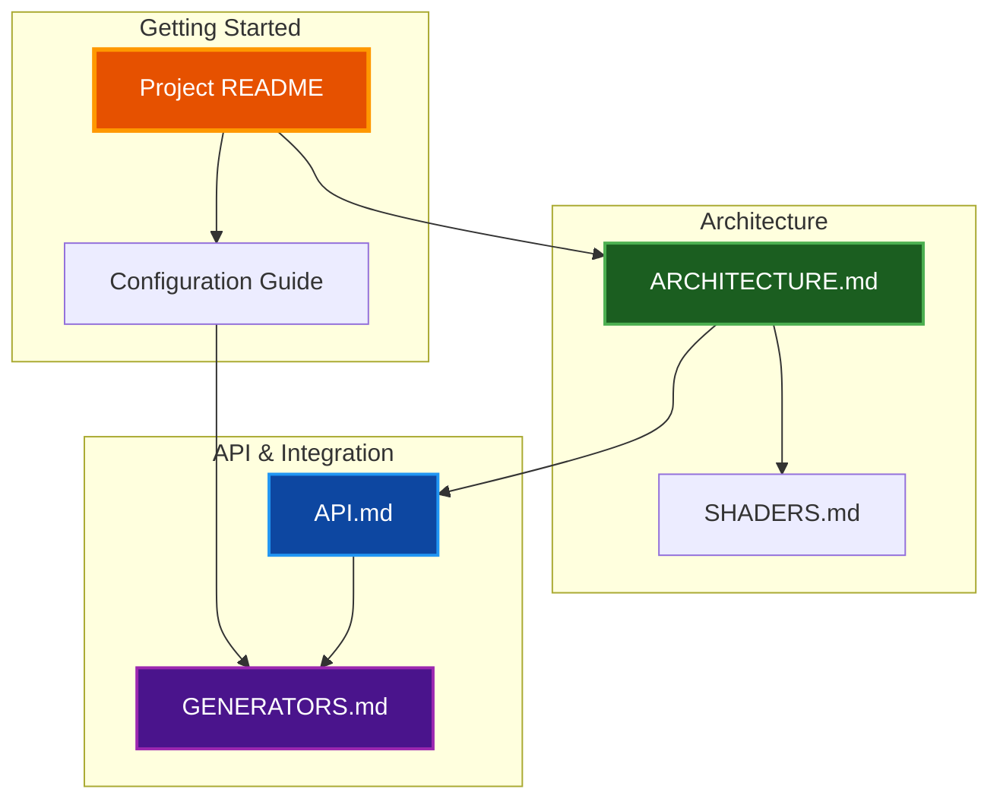

# Par Particle Life Documentation

Technical documentation for Par Particle Life, a GPU-accelerated particle life simulation.

## Documentation Index

| Document | Description |
|----------|-------------|
| [ARCHITECTURE.md](ARCHITECTURE.md) | System architecture, module structure, data flow |
| [API.md](API.md) | Public API reference for library usage |
| [CONFIGURATION.md](CONFIGURATION.md) | Configuration options and settings |
| [GENERATORS.md](GENERATORS.md) | Rule, color, and position generator reference |
| [SHADERS.md](SHADERS.md) | WGSL shader documentation |
| [DOCUMENTATION_STYLE_GUIDE.md](DOCUMENTATION_STYLE_GUIDE.md) | Documentation standards |

## Quick Links

### Getting Started
- [Project README](../README.md) - Installation and usage
- [Configuration Guide](CONFIGURATION.md) - Tuning your simulation

### Development
- [Architecture Overview](ARCHITECTURE.md) - Understanding the codebase
- [API Documentation](API.md) - Library integration
- [Shader Reference](SHADERS.md) - GPU shader details

### Customization
- [Generator Reference](GENERATORS.md) - Creating unique simulations
- [Configuration Options](CONFIGURATION.md#simulation-parameters) - All parameters

## Documentation Map

## Contributing to Documentation

Follow the [Documentation Style Guide](DOCUMENTATION_STYLE_GUIDE.md) when adding or modifying documentation:

- Use Mermaid diagrams (never ASCII art)
- Follow the color scheme for dark mode compatibility
- Include table of contents for documents > 500 words
- Specify language in all code blocks
- Update cross-references when modifying content
