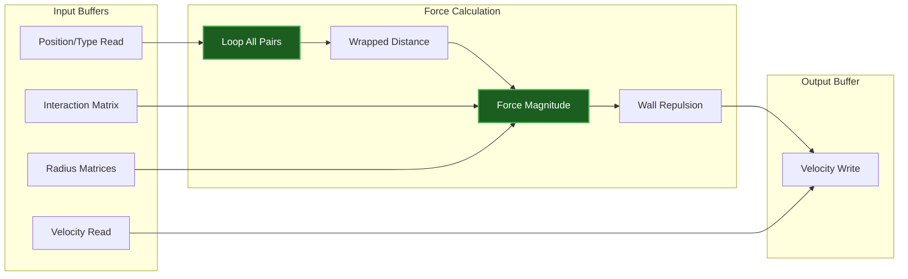
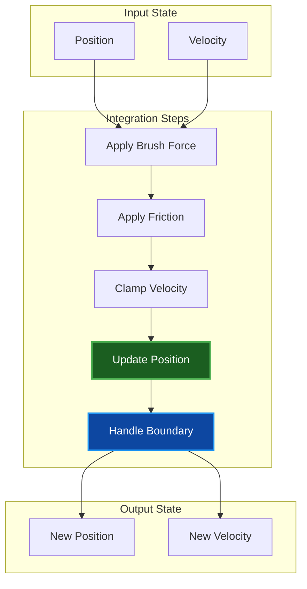
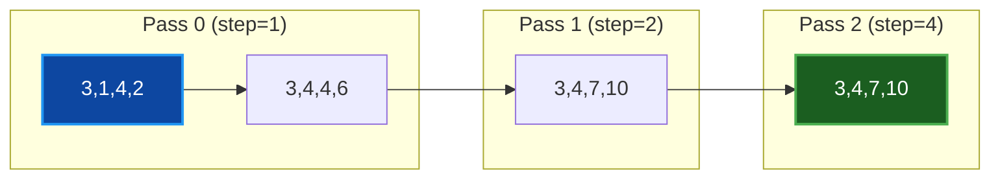

# Shader Documentation

Technical reference for WGSL shaders used in Par Particle Life. All shaders are in the `shaders/` directory.

## Table of Contents
- [Overview](#overview)
- [Compute Shaders](#compute-shaders)
- [Render Shaders](#render-shaders)
- [Spatial Hash Shaders](#spatial-hash-shaders)
- [Brush Shaders](#brush-shaders)
- [Shader Preprocessing](#shader-preprocessing)
- [Buffer Layouts](#buffer-layouts)
- [Related Documentation](#related-documentation)

## Overview

The shader system is organized into three categories:

| Category | Purpose | Shaders |
|----------|---------|---------|
| **Compute** | Physics simulation | Forces, advance, brush |
| **Render** | Particle visualization | Standard, glow, mirror, infinite |
| **Spatial** | Optimization | Clear, count, prefix sum, sort |

### Precision Modes

Shaders support configurable precision through preprocessor tokens:

| Token | Full Precision | Half Precision |
|-------|---------------|----------------|
| `POS_FLOAT` | `f32` | `f32` (always full) |
| `VEL_FLOAT` | `f32` | `f16` (optional) |

Position always uses F32 for world coordinate accuracy. Velocity can use F16 for bandwidth optimization when the GPU supports `SHADER_F16`.

## Compute Shaders

### particle_forces.wgsl

**Purpose:** Brute-force O(n²) force calculation between all particle pairs.



**Algorithm:**
1. For each particle i, iterate over all particles j
2. Calculate wrapped distance (if wrap mode enabled)
3. Skip if outside max interaction radius
4. Apply repulsion if within min radius
5. Apply attraction/repulsion based on interaction matrix
6. Accumulate forces, scale by force_factor
7. Add wall repulsion for Repel boundary mode

**Bindings:**

| Group | Binding | Type | Description |
|-------|---------|------|-------------|
| 0 | 0 | storage, read | Position/Type buffer |
| 0 | 1 | storage, read | Velocity input |
| 0 | 2 | storage, read_write | Velocity output |
| 0 | 3 | uniform | SimParams |
| 0 | 4 | storage, read | Interaction matrix |
| 0 | 5 | storage, read | Min radius matrix |
| 0 | 6 | storage, read | Max radius matrix |

**Workgroup Size:** 256

---

### particle_forces_binned.wgsl

**Purpose:** Spatially-optimized O(n*k) force calculation using spatial hashing.

**Algorithm:**
1. Get particle's bin coordinates
2. Iterate 3x3 neighborhood of bins
3. For each bin, check particles within using bin_offsets
4. Apply same force calculation as brute-force
5. Respect neighbor_budget for performance capping
6. Apply density-based force scaling if configured

**Key Optimizations:**
- Per-bin budget for symmetric force sampling
- Memory-coherent sorted particle access
- Early exit when budget exhausted
- Density scaling prevents explosions in clusters

**Additional Bindings:**

| Group | Binding | Type | Description |
|-------|---------|------|-------------|
| 0 | 6 | storage, read | Bin offsets (prefix sum result) |
| 0 | 7 | uniform | SpatialParams |
| 0 | 8 | storage, read | Sorted position/type buffer |

---

### particle_advance.wgsl

**Purpose:** Position integration, friction, velocity clamping, and boundary handling.



**Brush Force:**
- Checks if particle is within brush radius
- Applies radial force (attract/repel) with smooth falloff
- Adds directional force from brush movement
- Respects target_type filter

**Boundary Modes:**
- **Repel (0):** Bounce off walls, reverse velocity
- **Wrap (1,2,3):** Teleport to opposite edge

**Constants:**

| Constant | Value | Description |
|----------|-------|-------------|
| `BRUSH_FORCE_MULTIPLIER` | 50.0 | Scales brush radial force |
| `BRUSH_DIRECTIONAL_STRENGTH` | 40.0 | Scales brush movement force |

---

## Render Shaders

### particle_render.wgsl

**Purpose:** Standard particle rendering with smooth circular edges.

**Vertex Stage:**
1. Look up particle position and type
2. Get color from palette
3. Transform position through camera
4. Expand quad vertices by particle_size

**Fragment Stage:**
1. Calculate distance from quad center
2. Apply smoothstep anti-aliasing at edge
3. Discard pixels outside circle
4. Output color with alpha

**Camera Transform:**
```wgsl
let camera_scale = vec2<f32>(camera.scale_x, -camera.scale_y);
let camera_center = vec2<f32>(camera.center_x, camera.center_y);
let transformed_pos = (particle_pos - camera_center) * camera_scale;
```

---

### particle_render_glow.wgsl

**Purpose:** Particle rendering with radial glow effect.

**Differences from Standard:**
- Larger quad size (`particle_size * glow_size`)
- Radial falloff using `pow(falloff, steepness)`
- Pre-multiplied alpha for additive blending
- Configurable intensity

**Glow Parameters:**

| Parameter | Range | Description |
|-----------|-------|-------------|
| `glow_size` | 2.0-8.0 | Quad size multiplier |
| `glow_intensity` | 0.0-2.0 | Brightness multiplier |
| `glow_steepness` | 1.0-4.0 | Falloff sharpness |

---

### particle_render_mirror.wgsl

**Purpose:** Renders particles with edge duplicates for seamless wrapping.

**Algorithm:**
1. Calculate 5 or 9 copy positions (center + edges/corners)
2. Use instance index modulo to select copy offset
3. Render each particle at multiple locations

**Copy Layout (5 copies):**
```text
[+y]    [center]    [-y]
        [-x]    [+x]
```

**Copy Layout (9 copies):**
```text
[+x,+y] [+y]    [-x,+y]
[+x]    [center] [-x]
[+x,-y] [-y]    [-x,-y]
```

---

### particle_render_infinite.wgsl

**Purpose:** Renders infinite tiling based on camera position and zoom.

**Algorithm:**
1. Calculate visible tile range from camera
2. Iterate `num_copies_x * num_copies_y` tiles
3. Offset particle positions by tile coordinates
4. Render all visible instances

**Parameters:**

| Parameter | Description |
|-----------|-------------|
| `start_x` | First tile X offset (can be negative) |
| `start_y` | First tile Y offset |
| `num_copies_x` | Tiles in X direction |
| `num_copies_y` | Tiles in Y direction |

---

## Spatial Hash Shaders

### bin_clear.wgsl

**Purpose:** Zero-initialize bin count buffer before counting.

```wgsl
@compute @workgroup_size(256)
fn main(@builtin(global_invocation_id) id: vec3<u32>) {
    if (id.x < total_bins) {
        bin_counts[id.x] = 0u;
    }
}
```

---

### bin_count.wgsl

**Purpose:** Count particles per spatial bin.

**Algorithm:**
1. Calculate bin index from particle position
2. Atomic increment bin count
3. Store original index for later sorting

```wgsl
let bin = get_bin_index(particle.x, particle.y);
atomicAdd(&bin_counts[bin], 1u);
```

---

### bin_prefix_sum.wgsl

**Purpose:** Parallel prefix sum (Blelloch scan) to compute bin offsets.



**Algorithm:**
1. For each pass with step size 2^k
2. Add value at (i - step) to value at i
3. Ping-pong between buffer A and B
4. Result: cumulative sum (exclusive prefix)

---

### bin_sort.wgsl

**Purpose:** Sort particles by bin for coalesced memory access.

**Algorithm:**
1. For each particle, get its bin index
2. Use atomic counter to get unique slot in bin
3. Copy particle data to sorted buffer at offset

---

## Brush Shaders

### brush_circle.wgsl

**Purpose:** Render brush indicator circle in world space.

**Features:**
- Transforms brush position through camera
- Renders anti-aliased circle outline
- Color indicates tool type (draw, erase, attract, repel)

---

### brush_force.wgsl

**Purpose:** Apply brush forces to particles in compute pass.

> **Note:** Brush forces are now integrated into `particle_advance.wgsl` for efficiency.

---

## Shader Preprocessing

Shaders use token replacement at compile time:

| Token | Replacement |
|-------|-------------|
| `POS_FLOAT` | `f32` |
| `VEL_FLOAT` | `f32` or `f16` (if supported) |

This allows runtime selection of precision without shader variants.

---

## Buffer Layouts

### SimParams Uniform

```wgsl
struct SimParams {
    num_particles: u32,      // 0
    num_types: u32,          // 4
    force_factor: f32,       // 8
    friction: f32,           // 12
    repel_strength: f32,     // 16
    max_velocity: f32,       // 20
    world_width: f32,        // 24
    world_height: f32,       // 28
    boundary_mode: u32,      // 32 (0=Repel, 1=Wrap, 2=MirrorWrap, 3=InfiniteWrap)
    wall_repel_strength: f32,// 36
    particle_size: f32,      // 40
    dt: f32,                 // 44
    max_bin_density: f32,    // 48
    neighbor_budget: u32,    // 52
    _padding: [u32; 6],      // 56-80 (16-byte alignment)
}
```

### PosType Structure

```wgsl
struct PosType {
    x: f32,            // 0
    y: f32,            // 4
    particle_type: u32,// 8
    _padding: u32,     // 12 (16-byte aligned)
}
```

### SpatialParams Uniform

```wgsl
struct SpatialParams {
    num_particles: u32,// 0
    cell_size: f32,    // 4
    grid_width: u32,   // 8
    grid_height: u32,  // 12
}
```

---

## Related Documentation

- [ARCHITECTURE.md](ARCHITECTURE.md) - System architecture
- [CONFIGURATION.md](CONFIGURATION.md) - Configuration options
- [README.md](../README.md) - Project overview
